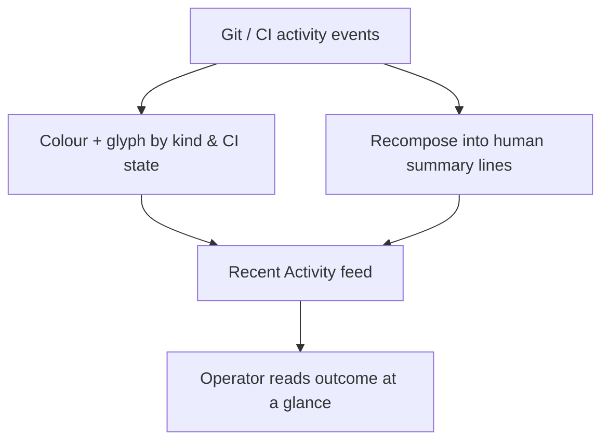

## prod_033_recent_activity_feed_legibility - Recent Activity feed legibility
> Date: 2026-06-27
> Status: Settled
> Related request: `req_284_make_the_recent_activity_feed_legible_for_git_and_ci_events`
> Related backlog: `item_516_colour_and_glyph_activity_markers_by_kind_and_ci_state`, `item_517_recompose_git_and_ci_activity_lines_into_human_summaries`
> Related task: `task_281_orchestrate_the_recent_activity_feed_legibility_polish`
> Related architecture: (none yet)
> Reminder: Update status, linked refs, scope, decisions, success signals, and open questions when you edit this doc.

# Overview
A presentation-only polish of the viewer's Recent Activity feed so git and CI events become scannable — coloured by kind and CI outcome, glyphed, accent-striped, and summarized in human lines — using only data already on the events and tooling already in the repo.

# Goals
- Let an operator read CI outcome and event kind from the feed at a glance, without opening entries.
- Separate the operational (git/CI) noise from the document flow visually.
- Reuse the badge-state, workflow, branch, and SHA already carried on the events plus the existing relative-time helper, adding zero dependencies.

# Non-goals
- Changing how activity events are collected, filtered, or stored, or adding new event kinds.
- Adding a frontend framework, icon font, or any new runtime dependency.
- Redesigning the rest of the viewer or the document-entry rendering.

# Scope and guardrails
- In: scaffolded request, product, backlog, orchestration task, validation, and handoff context.
- Out: unrelated workflow docs and implementation of generated tasks.

# Key product decisions
- Use structured input as the source of truth for generated docs.
- Keep generated write paths local and repo-bounded.

# Success signals
- Generated docs pass lint and audit without broad manual rewrites.
- Context-pack output can be handed to an implementation agent directly.

# References
- Product back-reference: `req_284_make_the_recent_activity_feed_legible_for_git_and_ci_events`
- Task back-reference: `task_281_orchestrate_the_recent_activity_feed_legibility_polish`
