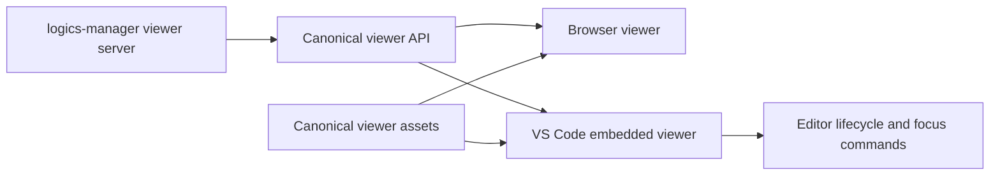

## prod_036_vs_code_embedded_viewer_parity - VS Code embedded viewer parity
> Date: 2026-07-05
> Status: Settled
> Related request: `req_287_make_the_vs_code_extension_host_the_same_logics_viewer_ui`
> Related backlog: `item_526_define_the_vs_code_embedded_viewer_host_contract`, `item_527_add_a_vs_code_managed_local_viewer_server_lifecycle`, `item_528_render_the_canonical_viewer_inside_the_vs_code_logics_panel`, `item_529_bring_viewer_write_actions_and_focus_workflows_to_parity_in_vs_code`, `item_530_retire_the_historical_vs_code_cockpit_and_command_surface`
> Related task: `task_284_orchestrate_vs_code_embedded_viewer_parity`
> Related architecture: (none yet)
> Reminder: Update status, linked refs, scope, decisions, success signals, and open questions when you edit this doc.

# Overview
Turn the VS Code extension's Logics panel into an embedded host for the canonical local viewer so VS Code and browser users see the same cockpit, actions, status surfaces, and visual behavior.

# Goals
- One user-facing viewer UI across browser and VS Code.
- One backend API contract for viewer data and actions.
- A smaller VS Code extension that focuses on editor integration, viewer lifecycle, and focus commands.
- A clear retirement path for historical VS Code-only workflow UI and commands.

# Non-goals
- Rebuilding the viewer UI in TypeScript for VS Code.
- Removing the standalone browser viewer.
- Adding a new frontend framework or replacing the current viewer host architecture.
- Changing Logics workflow semantics, status models, or CDX runtime behavior as part of this migration.
- Solving remote VS Code, Codespaces, or SSH tunneling beyond documenting unsupported or follow-up behavior.

# Scope and guardrails
- In: scaffolded request, product, backlog, orchestration task, validation, and handoff context.
- Out: unrelated workflow docs and implementation of generated tasks.

# Key product decisions
- Use structured input as the source of truth for generated docs.
- Keep generated write paths local and repo-bounded.

# Success signals
- Generated docs pass lint and audit without broad manual rewrites.
- Context-pack output can be handed to an implementation agent directly.

# References
- Product back-reference: `req_287_make_the_vs_code_extension_host_the_same_logics_viewer_ui`
- Task back-reference: `task_284_orchestrate_vs_code_embedded_viewer_parity`
