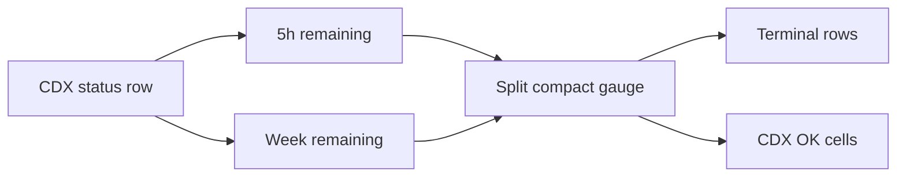

## prod_037_split_cdx_usage_gauge - Split CDX usage gauge
> Date: 2026-07-05
> Status: Proposed
> Related request: `req_289_split_the_cdx_usage_gauge_into_5h_and_week_columns`
> Related backlog: `item_532_render_split_5h_week_cdx_usage_gauge`
> Related task: `task_286_implement_split_5h_week_cdx_usage_gauge`
> Related architecture: (none yet)
> Reminder: Update status, linked refs, scope, decisions, success signals, and open questions when you edit this doc.

# Overview
Make the compact CDX session usage gauge show both short-window and weekly quota pressure in the same existing footprint.

# Goals
- Show 5h and week remaining usage side by side.
- Keep terminal and CDX status layouts compact.
- Preserve existing refresh interaction and accessibility.
- Reuse existing CDX status row fields.

# Non-goals
- Changing how CDX computes quota values.
- Adding a larger quota dashboard.
- Changing terminal row layout beyond the compact gauge contents.
- Adding new provider-specific quota models.

# Scope and guardrails
- In: scaffolded request, product, backlog, orchestration task, validation, and handoff context.
- Out: unrelated workflow docs and implementation of generated tasks.

# Key product decisions
- Use structured input as the source of truth for generated docs.
- Keep generated write paths local and repo-bounded.

# Success signals
- Generated docs pass lint and audit without broad manual rewrites.
- Context-pack output can be handed to an implementation agent directly.

# References
- Product back-reference: `req_289_split_the_cdx_usage_gauge_into_5h_and_week_columns`
- Task back-reference: `task_286_implement_split_5h_week_cdx_usage_gauge`
