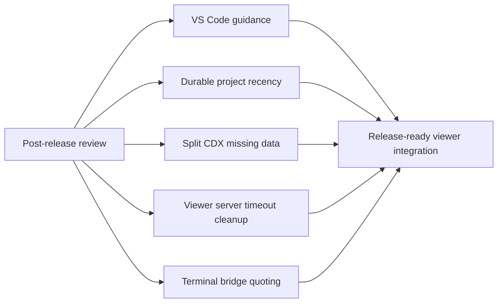

## prod_038_post_release_viewer_hardening - Post-release viewer hardening
> Date: 2026-07-05
> Status: Settled
> Related request: `req_290_post_release_viewer_and_vs_code_hardening`
> Related backlog: `item_533_restore_valid_vs_code_recovery_guidance_for_environment_checks`, `item_534_persist_viewer_project_last_used_order_outside_volatile_origins`, `item_535_make_split_cdx_usage_gauge_missing_data_semantics_symmetric`, `item_536_clean_up_embedded_viewer_server_processes_on_startup_timeout`, `item_537_harden_vs_code_terminal_bridge_command_handling`
> Related task: `task_287_orchestrate_post_release_viewer_hardening`
> Related architecture: (none yet)
> Reminder: Update status, linked refs, scope, decisions, success signals, and open questions when you edit this doc.

# Overview
Make the viewer and VS Code integration changes added since v2.15.7 ready for release by closing the review findings around command guidance, durable viewer state, usage telemetry display, process cleanup, and terminal command handling.

# Goals
- Keep VS Code recovery guidance accurate and actionable.
- Persist project recency in a place that is stable across embedded viewer server restarts.
- Render CDX usage data faithfully when partial usage windows are unavailable.
- Ensure embedded viewer server lifecycle failures do not leak child processes.
- Make terminal-launch behavior predictable across the supported VS Code environments.

# Non-goals
- Redesign the viewer project picker beyond the persistence fix.
- Change the CDX usage data contract except where missing fields need explicit handling.
- Introduce a new terminal abstraction unrelated to the existing VS Code bridge.
- Broaden this work into unrelated viewer UI cleanup or release packaging changes.

# Scope and guardrails
- In: scaffolded request, product, backlog, orchestration task, validation, and handoff context.
- Out: unrelated workflow docs and implementation of generated tasks.

# Key product decisions
- Use structured input as the source of truth for generated docs.
- Keep generated write paths local and repo-bounded.

# Success signals
- Generated docs pass lint and audit without broad manual rewrites.
- Context-pack output can be handed to an implementation agent directly.

# References
- Product back-reference: `req_290_post_release_viewer_and_vs_code_hardening`
- Task back-reference: `task_287_orchestrate_post_release_viewer_hardening`
