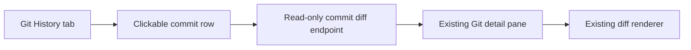

## prod_039_git_history_commit_diff_preview - Git history commit diff preview
> Date: 2026-07-12
> Status: Settled
> Related request: `req_291_preview_commit_diffs_from_git_history`
> Related backlog: `item_538_add_clickable_git_history_commit_diffs`
> Related task: `task_288_orchestrate_git_history_commit_diff_previews`
> Related architecture: (none yet)
> Reminder: Update status, linked refs, scope, decisions, success signals, and open questions when you edit this doc.
> Confidence: 100%
> Non-semantic edit: closeout refreshed generated back-reference text without changing product meaning.

# Overview
Extend the existing Git History tab so recent commits can be clicked to preview their diffs in the same detail pane and renderer already used by working-tree changes.

# Goals
- Make local commit history inspectable without leaving the Logics viewer.
- Reuse the current Git detail pane and diff renderer.
- Keep Git operations read-only, bounded, and provider-neutral.

# Non-goals
- A full commit browser, branch graph, blame view, or file-by-file commit explorer.
- Remote API calls to GitHub, GitLab, or any other provider.
- Commit mutation actions such as revert, cherry-pick, checkout, or reset.
- A new diff rendering dependency or separate history diff screen.

# Scope and guardrails
- In: scaffolded request, product, backlog, orchestration task, validation, and handoff context.
- Out: unrelated workflow docs and implementation of generated tasks.

# Key product decisions
- Use structured input as the source of truth for generated docs.
- Keep generated write paths local and repo-bounded.

# Success signals
- Generated docs pass lint and audit without broad manual rewrites.
- Context-pack output can be handed to an implementation agent directly.

# References
- Product back-reference: `item_538_add_clickable_git_history_commit_diffs`
- Task back-reference: `task_288_orchestrate_git_history_commit_diff_previews`
