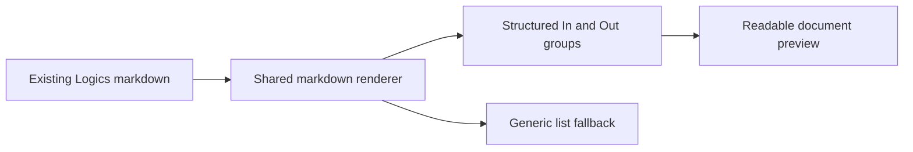

## prod_040_readable_scope_sections_in_document_previews - Readable Scope sections in document previews
> Date: 2026-07-12
> Status: Proposed
> Related request: `req_292_improve_scope_section_rendering_in_document_previews`
> Related backlog: `item_539_render_scope_in_and_out_groups_as_structured_preview_blocks`
> Related task: `task_289_orchestrate_scope_section_preview_rendering`
> Related architecture: (none yet)
> Reminder: Update status, linked refs, scope, decisions, success signals, and open questions when you edit this doc.
> Non-semantic edit: closeout refreshed generated back-reference text without changing product meaning.

# Overview
Make Scope sections in Logics document previews scan like structured In/Out groups while preserving the existing markdown authoring format.

# Goals
- Make generated backlog docs easier to read in the viewer.
- Preserve existing markdown files and scaffold output.
- Reuse the shared markdown renderer and viewer CSS.

# Non-goals
- Changing Logics document templates or schema.
- Building a full CommonMark parser or adding a markdown dependency.
- Redesigning all document detail typography.
- Changing non-Scope list rendering.

# Scope and guardrails
- In: scaffolded request, product, backlog, orchestration task, validation, and handoff context.
- Out: unrelated workflow docs and implementation of generated tasks.

# Key product decisions
- Use structured input as the source of truth for generated docs.
- Keep generated write paths local and repo-bounded.

# Success signals
- Generated docs pass lint and audit without broad manual rewrites.
- Context-pack output can be handed to an implementation agent directly.

# References
- Product back-reference: `item_539_render_scope_in_and_out_groups_as_structured_preview_blocks`
- Task back-reference: `task_289_orchestrate_scope_section_preview_rendering`
