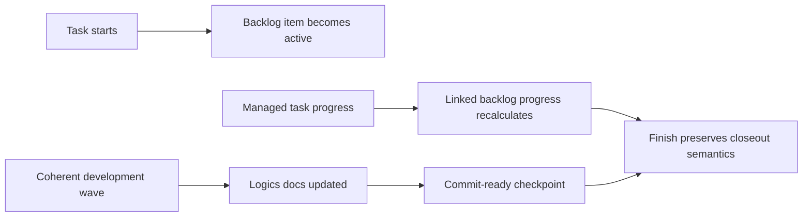

## prod_041_live_backlog_progress_and_checkpointed_task_execution - Live backlog progress and checkpointed task execution
> Date: 2026-07-12
> Status: Settled
> Related request: `req_293_sync_backlog_progress_during_task_development_and_codify_task_checkpoints`
> Related backlog: `item_540_propagate_task_progress_to_linked_backlog_items_during_development`
> Related task: `task_290_orchestrate_live_backlog_progress_and_checkpointed_task_guidance`
> Related architecture: (none yet)
> Reminder: Update status, linked refs, scope, decisions, success signals, and open questions when you edit this doc.

# Overview
Keep backlog progress truthful during task execution and make the task wave checkpoint contract explicit in generated workflow guidance.

# Goals
- Make backlog item progress reflect active task development before closeout.
- Give assistants a managed CLI path for task progress updates instead of manual indicator edits.
- Reuse the existing lifecycle model and ADR 009 checkpoint rule.
- Make generated tasks self-contained enough that operators do not need to repeat commit and documentation expectations for every task.

# Non-goals
- Automatically committing repository changes.
- Requiring a commit after every task checklist bullet or micro-step.
- Replacing backlog prioritization or adding a new project-management model.
- Changing the canonical Markdown indicator format.
- Inferring progress from Git history, file diffs, or elapsed time.

# Scope and guardrails
- In: scaffolded request, product, backlog, orchestration task, validation, and handoff context.
- Out: unrelated workflow docs and implementation of generated tasks.

# Key product decisions
- Use structured input as the source of truth for generated docs.
- Keep generated write paths local and repo-bounded.

# Success signals
- Generated docs pass lint and audit without broad manual rewrites.
- Context-pack output can be handed to an implementation agent directly.

# References
- Product back-reference: `item_540_propagate_task_progress_to_linked_backlog_items_during_development`
- Task back-reference: `task_290_orchestrate_live_backlog_progress_and_checkpointed_task_guidance`
