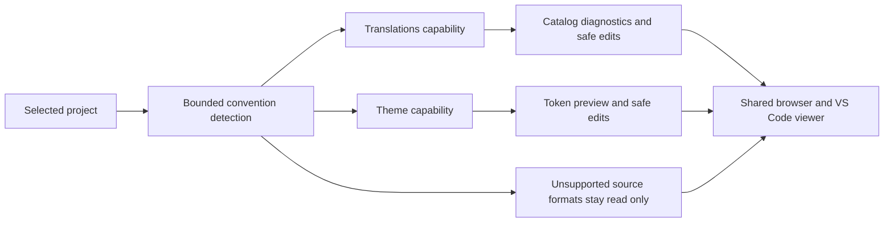

## prod_042_convention_aware_project_surfaces - Convention-aware project surfaces
> Date: 2026-07-13
> Status: Proposed
> Related request: `req_294_convention_aware_project_i18n_and_theme_viewer_screens`
> Related backlog: `item_542_define_and_detect_bounded_project_i18n_and_theme_conventions`, `item_543_add_translation_catalog_inspection_and_completeness_diagnostics`, `item_544_enable_safe_editing_of_supported_json_translation_catalogs`, `item_545_add_theme_token_inspection_and_live_preview`, `item_546_enable_safe_editing_of_css_custom_property_theme_tokens`, `item_547_harden_shared_host_parity_and_document_the_supported_project_conventions`
> Related task: `task_291_orchestrate_convention_aware_i18n_and_theme_viewer_delivery`
> Related architecture: (none yet)
> Reminder: Update status, linked refs, scope, decisions, success signals, and open questions when you edit this doc.

# Overview
Extend Logics Viewer with repository-aware project screens that appear only for supported conventions, beginning with internationalization catalogs and visual theme tokens. The feature favors deterministic, safe adapters over a generic plugin framework and preserves one shared implementation across browser and VS Code hosts.

# Goals
- Make translation completeness and theme choices visible without leaving the project cockpit.
- Provide safe in-viewer editing for deterministic data formats.
- Give unsupported or partially supported conventions an honest read-only or unavailable state.
- Establish a small capability contract that can support another project surface later without speculative extension machinery.
- Protect repository data and avoid leaking sampled project identity into committed artifacts.

# Non-goals
- Support every i18n library, message syntax, theme framework, or programming language in the first delivery.
- Rewrite JavaScript or TypeScript source modules containing translations or theme definitions.
- Build a third-party plugin SDK, adapter registry package, or user-installable marketplace.
- Render the full target application or guarantee pixel-perfect component previews.
- Translate text automatically or call an external translation service.
- Expose repository files outside the detected and validated project-tool sources.

# Scope and guardrails
- In: scaffolded request, product, backlog, orchestration task, validation, and handoff context.
- Out: unrelated workflow docs and implementation of generated tasks.

# Key product decisions
- Use structured input as the source of truth for generated docs.
- Keep generated write paths local and repo-bounded.

# Success signals
- Generated docs pass lint and audit without broad manual rewrites.
- Context-pack output can be handed to an implementation agent directly.

# References
- Product back-reference: `req_294_convention_aware_project_i18n_and_theme_viewer_screens`
- Task back-reference: `task_291_orchestrate_convention_aware_i18n_and_theme_viewer_delivery`
