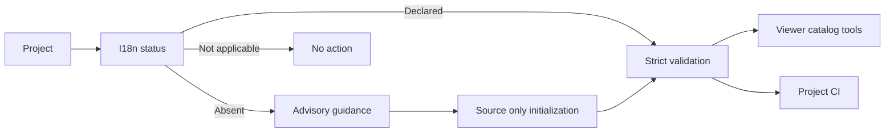

## prod_043_project_owned_internationalization_readiness - Project-owned internationalization readiness
> Date: 2026-07-13
> Status: Proposed
> Related request: `req_295_optional_project_owned_i18n_contract_and_lifecycle_tooling`
> Related backlog: `item_548_define_the_versioned_optional_i18n_contract_and_schema`, `item_549_add_i18n_contract_lifecycle_commands_and_validation`, `item_550_make_i18n_readiness_a_default_new_project_consideration`, `item_551_use_the_declared_i18n_contract_in_viewer_project_tools`, `item_552_document_and_harden_the_i18n_contract_rollout`
> Related task: `task_292_orchestrate_optional_i18n_contract_and_lifecycle_delivery`
> Related architecture: (none yet)
> Reminder: Update status, linked refs, scope, decisions, success signals, and open questions when you edit this doc.

# Overview
Give projects a small optional contract that makes internationalization readiness explicit, testable, visible in Logics Manager, and usable by the viewer without forcing one framework or immediate multilingual delivery.

# Goals
- Establish one portable contract for catalog layout and correctness across frontend stacks.
- Make i18n readiness the default starting posture for new user-interface projects.
- Provide deterministic local diagnostics and migration planning for existing projects.
- Reuse the release-contract interaction model where it fits while keeping the i18n lifecycle smaller.
- Keep legacy repositories and non-user-interface projects unblocked until they deliberately adopt or decline the contract.

# Non-goals
- Mandate multiple translated locales at project creation time.
- Select or distribute one runtime i18n library for every framework.
- Translate text automatically or call an external translation service.
- Rewrite executable JavaScript or TypeScript translation dictionaries during initialization.
- Copy the release evidence store, publication gates, or state machine into the i18n lifecycle.
- Make every existing backend, library, prototype, or developer tool fail because it has no i18n contract.

# Scope and guardrails
- In: scaffolded request, product, backlog, orchestration task, validation, and handoff context.
- Out: unrelated workflow docs and implementation of generated tasks.

# Key product decisions
- Use structured input as the source of truth for generated docs.
- Keep generated write paths local and repo-bounded.

# Success signals
- Generated docs pass lint and audit without broad manual rewrites.
- Context-pack output can be handed to an implementation agent directly.

# References
- Product back-reference: `req_295_optional_project_owned_i18n_contract_and_lifecycle_tooling`
- Task back-reference: `task_292_orchestrate_optional_i18n_contract_and_lifecycle_delivery`
