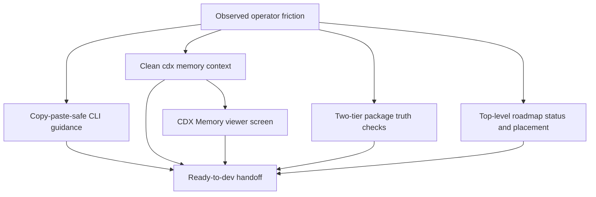

## prod_045_logics_operator_ergonomics - Logics operator ergonomics
> Date: 2026-07-28
> Status: Proposed
> Related request: `req_297_improve_logics_operator_ergonomics_for_evidence_memory_packaging_and_roadmap_flow`
> Related backlog: `item_557_make_logics_remediation_messages_copy_paste_safe`, `item_558_normalize_workflow_status_aliases_before_persistence`, `item_559_harden_release_evidence_help_and_examples`, `item_560_add_package_truth_checks_for_shipped_cli_behavior`, `item_561_document_rtk_wrapper_safe_command_forms`, `item_562_use_cdx_memory_as_the_structured_source_for_assistant_context`, `item_563_make_roadmap_status_and_placement_part_of_the_daily_flow`
> Related task: `task_294_orchestrate_logics_operator_ergonomics_improvements`
> Related architecture: (none yet)
> Reminder: Update status, linked refs, scope, decisions, success signals, and open questions when you edit this doc.
> Non-semantic edit: Added overview Mermaid diagram.

# Overview
Make Logics Manager easier for agents and operators to use correctly by turning known friction points into copy-paste-safe CLI guidance, package truth checks, cleaned CDX memory context visible in the viewer, and practical top-level roadmap maintenance commands.

# Goals
- Reduce avoidable operator mistakes in common Logics remediation and release-evidence flows.
- Make assistant handoffs cleaner by consuming structured `cdx memory` output, cleaning terminal noise, and exposing the result in a CDX Memory viewer sub-screen.
- Prove package/install behavior from built artifacts before release work is trusted, with a cheap `ci:check` metadata gate and a heavier clean-wheel doctor/release gate.
- Make roadmap docs useful during daily planning and closeout through top-level `logics-manager roadmap status/place` commands instead of only companion-document views.

# Non-goals
- Replacing the existing request -> backlog -> task workflow chain.
- Creating a separate memory database inside Logics Manager.
- Making roadmap placement mandatory in repositories without roadmap docs.
- Adding drag-and-drop roadmap editing or an AI roadmap planner in this wave.
- Adding a Codex memory editor, mutation UI, or timeline in this wave.
- Changing RTK behavior itself.

# Scope and guardrails
- In: scaffolded request, product, backlog, orchestration task, validation, and handoff context.
- Out: unrelated workflow docs and implementation of generated tasks.

# Key product decisions
- Use structured input as the source of truth for generated docs.
- Keep generated write paths local and repo-bounded.
- Use `logics-manager roadmap ...` as the primary roadmap surface; keep `flow roadmap ...` aliases only when they are cheap wrappers.
- Split packaging proof into a fast metadata coverage check in `ci:check` and a slower clean-wheel install check in `doctor packaging` / release validation.
- Add a read-only CDX Memory sub-screen under the existing CDX viewer area, backed by the same cleaned `cdx memory` payload used by assistant context.
- Deliver the broad ergonomics request as separate implementation slices and commits when practical; avoid one large mixed change.
- Treat `cdx memory ... --json` as the official memory source. Legacy file reads may exist only as degraded/unavailable fallbacks, not as the normal path.
- Keep roadmap support focused on daily placement and status, not a full planning database or AI planner.

# Open questions
- Should `req_297` be implemented as one release wave or as separate operator-controlled commits per slice? Recommendation: separate commits by slice because the request touches CLI help, release evidence, packaging, memory, and roadmap behavior.
- Should legacy `.cdx` memory file reads be supported at all? Recommendation: only as a fallback state when `cdx memory` is unavailable.
- Should roadmap closeout prompts be blocking? Recommendation: no; they should be visible and copy-paste-safe, but non-blocking.

# Success signals
- Generated docs pass lint and audit without broad manual rewrites.
- Context-pack output can be handed to an implementation agent directly.
- Operators can inspect current/global CDX memory quality, warnings, and cleaned handoff text in the viewer before using it as assistant context.

# References
- Product back-reference: `req_297_improve_logics_operator_ergonomics_for_evidence_memory_packaging_and_roadmap_flow`
- Task back-reference: `task_294_orchestrate_logics_operator_ergonomics_improvements`
