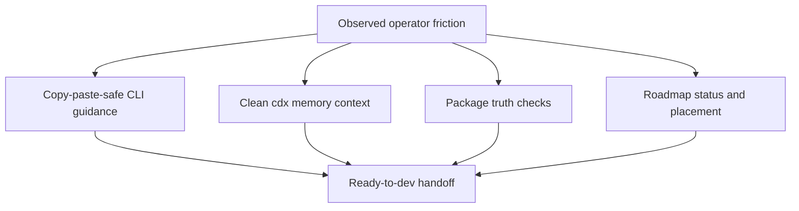

## prod_045_logics_operator_ergonomics - Logics operator ergonomics
> Date: 2026-07-28
> Status: Proposed
> Related request: `req_297_improve_logics_operator_ergonomics_for_evidence_memory_packaging_and_roadmap_flow`
> Related backlog: `item_557_make_logics_remediation_messages_copy_paste_safe`, `item_558_normalize_workflow_status_aliases_before_persistence`, `item_559_harden_release_evidence_help_and_examples`, `item_560_add_package_truth_checks_for_shipped_cli_behavior`, `item_561_document_rtk_wrapper_safe_command_forms`, `item_562_use_cdx_memory_as_the_structured_source_for_assistant_context`, `item_563_make_roadmap_status_and_placement_part_of_the_daily_flow`
> Related task: `task_294_orchestrate_logics_operator_ergonomics_improvements`
> Related architecture: (none yet)
> Reminder: Update status, linked refs, scope, decisions, success signals, and open questions when you edit this doc.
> Non-semantic edit: Added overview Mermaid diagram.

# Overview
Make Logics Manager easier for agents and operators to use correctly by turning known friction points into copy-paste-safe CLI guidance, package truth checks, cleaned CDX memory context, and practical roadmap maintenance commands.

# Goals
- Reduce avoidable operator mistakes in common Logics remediation and release-evidence flows.
- Make assistant handoffs cleaner by consuming structured `cdx memory` output and cleaning terminal noise.
- Prove package/install behavior from built artifacts before release work is trusted.
- Make roadmap docs useful during daily planning and closeout instead of only existing as companion documents.

# Non-goals
- Replacing the existing request -> backlog -> task workflow chain.
- Creating a separate memory database inside Logics Manager.
- Making roadmap placement mandatory in repositories without roadmap docs.
- Adding drag-and-drop roadmap editing or an AI roadmap planner in this wave.
- Changing RTK behavior itself.

# Scope and guardrails
- In: scaffolded request, product, backlog, orchestration task, validation, and handoff context.
- Out: unrelated workflow docs and implementation of generated tasks.

# Key product decisions
- Use structured input as the source of truth for generated docs.
- Keep generated write paths local and repo-bounded.

# Success signals
- Generated docs pass lint and audit without broad manual rewrites.
- Context-pack output can be handed to an implementation agent directly.

# References
- Product back-reference: `req_297_improve_logics_operator_ergonomics_for_evidence_memory_packaging_and_roadmap_flow`
- Task back-reference: `task_294_orchestrate_logics_operator_ergonomics_improvements`
