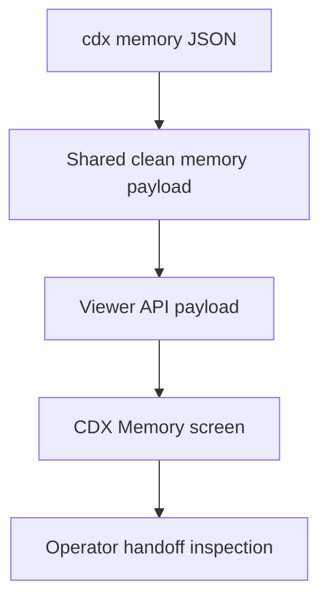

## prod_046_cdx_memory_viewer_inspection - CDX Memory viewer inspection
> Date: 2026-07-28
> Status: Settled
> Related request: `req_298_add_a_cdx_memory_viewer_screen_for_cleaned_handoff_inspection`
> Related backlog: `item_564_expose_cleaned_cdx_memory_through_a_viewer_api_payload`, `item_565_render_the_cdx_memory_sub_screen_in_the_viewer`, `item_566_surface_cdx_memory_quality_warnings_without_blocking_cdx_use`, `item_567_validate_cdx_memory_screen_integration_with_focused_visual_and_payload_tests`
> Related task: `task_295_orchestrate_cdx_memory_viewer_screen_delivery`
> Related architecture: (none yet)
> Reminder: Update status, linked refs, scope, decisions, success signals, and open questions when you edit this doc.
> Non-semantic edit: Added overview Mermaid diagram.

# Overview
Add a read-only CDX Memory sub-screen to the Logics viewer so operators can inspect cleaned Codex memory scopes and handoff quality before using memory-derived context.

# Goals
- Make current/global Codex memory visible from the existing CDX viewer area.
- Reuse the shared cleaned memory payload from the assistant context command.
- Show quality signals that help operators decide whether memory is trustworthy for handoff.
- Keep the screen read-only and bounded.

# Non-goals
- Editing, appending, clearing, or initializing Codex memory.
- Replacing `sync context-pack` or Logics docs as the project source of truth.
- Building a full memory timeline or diff UI.
- Adding a new top-level viewer navigation item.

# Scope and guardrails
- In: scaffolded request, product, backlog, orchestration task, validation, and handoff context.
- Out: unrelated workflow docs and implementation of generated tasks.

# Key product decisions
- Use structured input as the source of truth for generated docs.
- Keep generated write paths local and repo-bounded.
- Optimize the first screen for daily operator confidence, not deep diagnostics: scope, quality, latest useful handoff, warnings, and a compact raw/cleaned toggle.
- Reuse the shared cleaned `cdx memory` logic from the assistant-context work. Do not duplicate raw `.cdx` scraping in the viewer.
- Keep long raw content folded by default so the CDX surface stays scannable.
- Render degraded states explicitly when `cdx memory` is unavailable, empty, unsupported, stale, or noisy.

# Open questions
- Should the screen favor diagnostic detail or daily operation? Recommendation: daily operation first; keep detailed raw excerpts available but collapsed.
- Should it support memory mutation later? Recommendation: no for this corpus. Mutation belongs in a separate explicit request.
- Should browser visual coverage be broad? Recommendation: use the smallest existing browser-host coverage that catches rendering, scope switching, toggles, warning states, and layout regressions.

# Success signals
- Generated docs pass lint and audit without broad manual rewrites.
- Context-pack output can be handed to an implementation agent directly.

# References
- Product back-reference: `req_298_add_a_cdx_memory_viewer_screen_for_cleaned_handoff_inspection`
- Task back-reference: `task_295_orchestrate_cdx_memory_viewer_screen_delivery`
