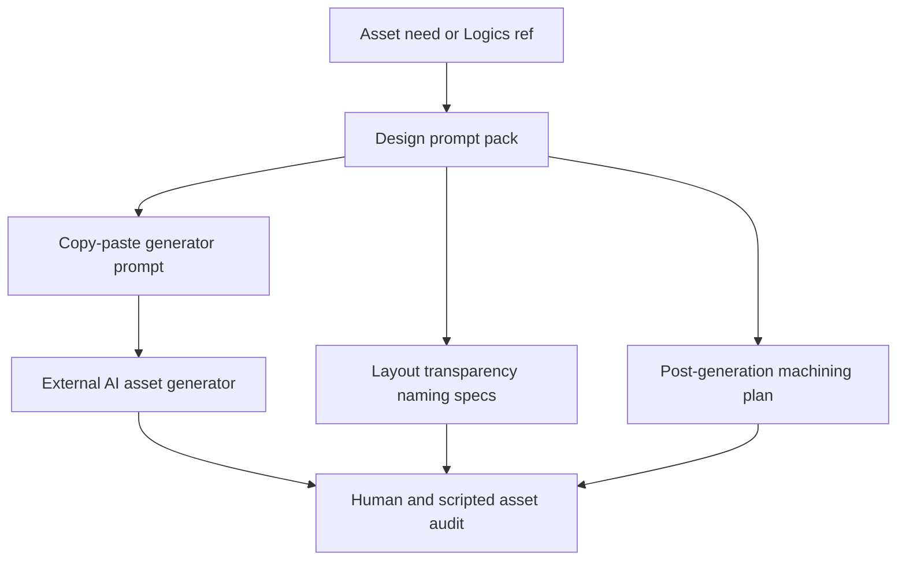

## prod_047_logics_design_asset_prompt_packs - Logics Design asset prompt packs
> Date: 2026-07-28
> Status: Proposed
> Related request: `req_299_add_logics_design_asset_prompt_packs_for_ai_generated_artwork_workflows`
> Related backlog: `item_568_define_the_logics_design_prompt_pack_schema_and_templates`, `item_569_implement_the_logics_manager_design_cli`, `item_570_generate_cr_league_style_icon_sheet_and_object_set_prompt_contracts`, `item_571_add_asset_machining_and_audit_instructions_to_design_packs`, `item_572_document_and_validate_the_logics_design_workflow`
> Related task: `task_296_orchestrate_logics_design_asset_prompt_pack_delivery`
> Related architecture: (none yet)
> Reminder: Update status, linked refs, scope, decisions, success signals, and open questions when you edit this doc.
> Non-semantic edit: Added overview Mermaid diagram.

# Overview
Add a `logics-manager design` workflow that turns Logics needs into copy-paste-ready AI asset prompts plus explicit generation, layout, naming, transparency, machining, and audit contracts.

# Goals
- Make AI asset generation requests repeatable and reviewable before any image is generated.
- Capture asset-sheet and post-processing constraints that proved useful in CR League.
- Help agents choose sensible layouts such as 4x4, 2x2, or single-image prompts based on asset type and count.
- Keep generated image assets out of scope while producing a practical handoff for external generators and local machining.

# Non-goals
- Calling ChatGPT, Midjourney, or any image-generation API.
- Editing generated images, removing backgrounds, or importing assets automatically in the first wave.
- Replacing project-specific art direction or human visual review.
- Building a full design asset manager, DAM, or image approval workflow.
- Shipping generated image files in Logics docs.

# Scope and guardrails
- In: scaffolded request, product, backlog, orchestration task, validation, and handoff context.
- Out: unrelated workflow docs and implementation of generated tasks.

# Key product decisions
- Use structured input as the source of truth for generated docs.
- Keep generated write paths local and repo-bounded.

# Success signals
- Generated docs pass lint and audit without broad manual rewrites.
- Context-pack output can be handed to an implementation agent directly.

# References
- Product back-reference: `req_299_add_logics_design_asset_prompt_packs_for_ai_generated_artwork_workflows`
- Task back-reference: `task_296_orchestrate_logics_design_asset_prompt_pack_delivery`
