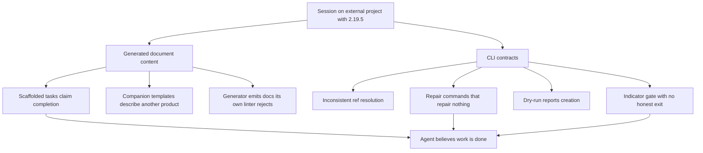

## prod_048_agent_facing_correctness_of_generated_docs_and_cli_contracts - Agent-facing correctness of generated docs and CLI contracts
> Date: 2026-08-01
> Status: Settled
> Related request: `req_300_agent_facing_correctness_of_generated_docs_and_cli_contracts`
> Related backlog: item_573_make_dry_run_and_command_output_report_what_actually_happened
> Related task: `task_297_orchestrate_agent_facing_correctness_remediation`
> Related architecture: (none yet)
> Reminder: Update status, linked refs, scope, decisions, success signals, and open questions when you edit this doc.

# Overview
Field report from a full working session on an external project (`cts`, recruiting
dashboard) using `logics-manager 2.19.5` end to end: scaffolding four request
chains, auditing them for handoff, closing a roadmap, opening another, and
delivering one chain through `flow start` -> `flow progress` -> `flow closeout`.

The workflow model held up well. What did not hold up is the **content the tool
generates** and the **consistency of its CLI contracts**. Two classes of problem
dominated: generated documents that assert things that are false about the
project they describe, and commands whose accepted reference form, repair
behaviour, or success message does not match what they actually do.

This continues `prod_045_logics_operator_ergonomics`, which addressed operator
friction. The findings here are narrower and more serious: they are cases where
an agent that trusts the tool's output produces wrong work.



# Goals
- Make every generated document true about the project it is generated into, or
  visibly empty, never confidently wrong.
- Make one reference form work across every command that accepts a reference.
- Make advertised repair commands either fix the finding they are advertised for
  or stop advertising themselves.
- Give the "modified without updating indicators" gate an honest exit for
  semantic edits that do not change status.
- Make dry-run output distinguishable from applied output.

# Non-goals
- Changing the request -> backlog -> task -> product/roadmap workflow model,
  which worked well.
- Redesigning the CLI surface or renaming existing commands.
- Adding new document kinds.
- Changing lint or audit rule severity.

# Observed friction

Ordered by how much damage a trusting agent would do.

## 1. Scaffolded tasks declare themselves complete (highest severity)

Every task produced by `flow scaffold request-chain` contains, verbatim:

```
# AC Traceability
- request-AC1 -> This task. Proof: scaffold command generated the request-chain corpus.
- request-AC4 -> This task. Proof: optional context-pack handoff is supported.
- request-AC6 -> This task. Proof: dry-run and collision checks bound file changes.
- request-AC8 -> This task. Proof: CLI help documents the one-pass scaffold workflow.

# Validation
- Run `python3 -m logics_manager lint --require-status`.
- Run scaffold command tests.

# Report
- Implementation complete.
```

Three separate problems in one block:

- The AC traceability maps to **the scaffold command's own acceptance criteria**,
  not the request's. On a request with 14 ACs about candidate filters and mobile
  layout, the task claimed AC1/AC4/AC6/AC8 were satisfied by "CLI help documents
  the one-pass scaffold workflow".
- `# Report` says **"Implementation complete."** on a task at `Progress: 0%` and
  `Status: Ready`. An agent opening this task first reads a finished job.
- `# Validation` prescribes `python3 -m logics_manager lint` and "scaffold command
  tests" — the *tool's* verification, not the target project's. The target
  project's real gates (`npm test`, `lint`, `check:size`, `build`, `a11y`) are
  never mentioned.

This reproduced identically on all four tasks I inspected (`task_031` through
`task_034`), including two scaffolded by a different session. I hand-rewrote all
four. Suggested fix: emit `# Report\n- Not started.`, derive AC traceability from
the input's `backlog_items[].request_acs` (which the scaffold input already
carries and which I had to re-derive by hand), and either leave `# Validation`
empty or seed it from a project-level convention.

## 2. Companion templates describe an unrelated product

`flow companion architecture --title "Pipeline triage model for the New stage"`
produced a document whose entire body was about something else:

```
# Context
- The runtime is being consolidated into the main repo.
- Legacy skill/bootstrap boundaries are being retired.

# Decision
- Prefer a native Python runtime with a minimal plugin shell.

# Consequences
- The CLI becomes the primary operational surface.
```

This is Logics Manager's own architecture, leaked into a recruiting-product ADR.
100% of the generated body was discarded. An empty scaffold with section headers
would have been strictly more useful, because it would not have to be detected as
wrong first.

## 3. The generator emits documents its own linter rejects

The ADR created by `flow companion architecture` immediately failed
`logics-manager lint`:

```
- logics/architecture/adr_002_...md: missing indicator: Drivers
```

The generator does not emit a `> Drivers:` line; the linter requires it. Any
`companion architecture` call is followed by a guaranteed lint failure the caller
must fix by hand.

## 4. Advertised repair commands repair nothing

`audit` reported four `companion_doc_missing_mermaid` warnings. `flow repair
mermaid --refs <request-ref> --dry-run` returned:

```
Repair mermaid: would change 0 file(s).
```

Same for `flow repair ac-traceability <request-path> --dry-run` against tasks
carrying the boilerplate from finding 1 — `would change 0 file(s)`, while lint and
audit continued to flag them. I ended up writing five Mermaid diagrams and four AC
traceability blocks by hand.

Either these repairs should cover the findings that name them, or the findings
should not imply a repair exists.

## 5. Reference resolution differs per command, with misleading errors

The same logical reference is accepted, rejected, or unrecognised depending on the
subcommand:

| Command | Input | Result |
| --- | --- | --- |
| `flow validate` | a request full ref | works |
| `sync update-indicators` | a task full ref | works |
| `flow repair ac-traceability` | a task full ref | `Source not found` |
| `flow repair ac-traceability` | a task file path | `Expected source under logics/request` |
| `flow repair mermaid --refs` | a product-brief full ref | `Workflow source not found` |
| `flow repair mermaid --refs` | a product-brief file path | `Workflow source not found` |

The `Source not found` message for a document that plainly exists is the worst of
these: it says the document is missing when the real problem is that the command
only accepts requests. The path form eventually revealed that, but only after
three attempts. `--refs` is also plural and kind-agnostic in name while being
kind-restricted in behaviour.

## 6. Dry-run reports that it created things

```
$ logics-manager flow companion architecture --title "..." --dry-run
...
Created companion doc: logics/architecture/adr_002_....md
```

Nothing was written — I verified with `ls`. `flow roadmap propose --dry-run`
behaves the same way ("Created roadmap: ..."). An agent that trusts this message
will skip the real invocation and continue against a document that does not
exist. The dry-run path should say `Would create`, as `flow scaffold` correctly
does (`Would scaffold request chain: ...`).

## 7. The indicator gate has no honest exit for roadmaps

Editing a roadmap body triggers:

```
modified without updating indicators: Date, Related product, Related request, Reminder, Status
fix: logics-manager sync update-indicators <ref> --understanding <n> --confidence <n>
   ; or add `> Non-semantic edit:` for intentionally non-semantic edits
```

The suggested fix does not work: `--understanding` / `--confidence` are not in the
approved indicator set for roadmaps, so the gate stays red after running exactly
what it recommended. The remaining flags are `--status`, `--progress`, `--theme`,
`--complexity`; none applied, since the roadmap legitimately stayed `Active`.

That left only the `> Non-semantic edit:` marker — for a change that restructured
the milestone set. I used it and worded the marker to describe the restructuring
honestly, but the workflow pushed me to label a semantic edit as non-semantic.
A gate whose only satisfiable exit is a false statement is a correctness problem,
not an ergonomics one.

Related: `sync update-indicators <ref>` with no flags errors with `At least one
workflow indicator is required` (`sync.py:673`) instead of performing a no-op
refresh, which is what "I edited the body, re-baseline it" actually needs.

**Root cause shared with findings 8 and 9.** `APPROVED_WORKFLOW_INDICATORS`
(`sync.py:59`) is a single global tuple, while `lint.py:KINDS` declares the
indicator set **per kind** — `roadmap` carries neither `Understanding` nor
`Confidence`. The two lists never consult each other, so the gate can recommend
a flag the target kind does not accept. All three findings live in
`update_workflow_indicators_payload` (`sync.py:667-705`): per-kind validation
closes 7, a no-op re-baseline path closes 8, and normalising the written value
closes 9. Three findings, one function.

## 8. Indicator values must drift to satisfy the gate

`sync update-indicators` returns `changed: False` when passed the current values,
and the gate stays red. To clear it I had to invent numeric movement:
`90 -> 92 -> 93` on Understanding and `85 -> 88 -> 89` on Confidence across three
edits, none of which corresponded to a real change in understanding. These fields
degrade into edit counters. A dedicated `--touch` / re-baseline flag would remove
the incentive to fabricate.

## 9. `sync update-indicators` writes a different format than the templates

Templates and pre-existing docs use `> Understanding: 90%`. After
`sync update-indicators --understanding 92`, the doc reads `> Understanding: 92`,
with no `%`. The corpus now mixes both forms, and `INDEX.md` renders both.

## 10. Closeout preflight: the documented fix does not satisfy the check

`flow validate-closeout` reported:

```
validation_evidence_missing: `# Validation` has no concrete passing validation evidence
repair: python3 -m logics_manager flow closeout <task> --validation "... passed"
```

Running `flow closeout <task> --validation "npm test passed (26 assertions, 0
failures); npm run lint passed; ..."` failed with the **same** preflight error and
`changed files: 0`. What actually worked was hand-editing the `# Validation`
section from imperative form ("Run `npm test`...") into past-tense statements
("`npm test` passed on 2026-08-01: 26 assertions, 0 failures").

**Root cause, confirmed in code.** The field report attributed this to the gate
running before the writer. The opposite is true: the writer runs first
(`flow/__init__.py:3457-3461`), the preflight second (`3485`), and the
`changed files: 0` comes from the rollback that restores the snapshot when the
preflight fails (`3489-3491`). The evidence was written, then reverted.

The actual rejection happens in `flow_evidence.py:32`:

```python
invalid_markers = ("...", "todo", "tbd", "pending", "needs ", "need ", "not ok", "failed", "failure", "failing")
```

`0 failures` contains the substring `failure`, so the bullet is skipped. The
evidence was rejected **for being precise**: stating the failure count is what
disqualified it. `has_validation_evidence` iterates per bullet, so the
hand-written version passed only because it was multi-line — `npm run lint
passed on 2026-08-01` cleared the check while the `npm test` line carrying
`0 failures` was skipped exactly as the flag's single blob had been. Reproduced:

| Input to `has_validation_evidence` | Result |
| --- | --- |
| the `--validation` blob as one bullet | `False` |
| same blob with `, 0 failures` removed | `True` |
| the `npm test` line alone, with `0 failures` | `False` |
| the hand-written multi-bullet section | `True` |

**Regression, not a long-standing defect.** The blocklist was introduced by
`72d3553e` "fix: reject weak closeout validation evidence" (2026-06-07, shipped
in `v2.10.0`). Before it there was no substring filter and the blob would have
been accepted. A hardening fix overshot.

This narrows the correction considerably. It is not a reordering of gate and
writer — which would be a risky refactor of the closeout pipeline — but a
detector fix in a 74-line module, testable directly on `has_validation_evidence`
without driving a full closeout. The check itself is good and caught a real gap;
only its matching is wrong.

## 11. Status vocabularies are discoverable only through errors

There is no obvious way to ask which statuses a document kind accepts. I learned
the roadmap vocabulary by guessing wrong:

```
`Completed` is not a valid status for roadmap
(allowed: Draft, Proposed, Active, Accepted, Validated, Rejected, Superseded, Settled, Archived)
```

The error is excellent; the only way to reach it is to fail. Same for scaffold
input: `request.complexity` rejected `Small` and named the enum
(`Low, Medium, High`) only on failure.

The scaffold input schema has the same gap in both directions. The `corpus`
skill documents the `context_pack.profile` enum but not `complexity`, which is
how `Small` was reached. Conversely, the input silently accepts `priority` on
backlog items, a key absent from the documented list in
`skill_assets/corpus/SKILL.md:23` — it was passed only because an existing file
happened to carry it. Undocumented-but-accepted is the mirror image of the same
problem: neither the accepted set nor the rejected set is discoverable up front.

## 12. `flow list` prints help in its documented default form

`logics-manager flow list` printed the usage block instead of a listing.
`logics-manager flow list --kind all` listed correctly. The help text's own first
example is `logics-manager flow list`.

## 13. A doc cannot quote a reference as an example

Writing this brief tripped the audit three times: the reference-form table above
originally quoted real-looking refs in backticks, and `companion_doc_refs_missing_target`
resolved them as genuine links to documents in another repository:

```
BLOCKING: [companion_doc_refs_missing_target] companion doc references missing target `<a request ref>`
```

Fenced code blocks are not an escape either: after fixing the table, the audit
still resolved the ref inside the fenced sample of its own error message above,
so quoting the diagnostic reproduced the diagnostic. Any document that discusses
references — a runbook, a convention note, this brief — cannot show one, in prose
or in a code block, without inventing an unresolvable link. I found no escape
syntax and ended up describing the forms instead of showing them, which makes the
table above less useful than it should be.

This also means the rule cannot distinguish "this document links to a missing
document" from "this document is about links". A brief written in one repository
about work in another can never satisfy it.

**Confirmed and split in two.** `audit.py:155-157` strips only ` ```mermaid `
blocks before extracting references; no other fence and no inline code span is
excluded. The in-scope half is therefore a parser fix, not a design decision: a
reference inside a code block is text, not a link. The deferred half is an escape
syntax for citing a reference in running prose, which needs design and which the
parser fix largely subsumes.

## 15. Commands do not report what they actually changed

Three instances of the same shape as finding 6, all found while working normally:

- `flow start` also modified the three linked backlog items, not just the named
  task. Plausibly intended, but nothing in the output says so. An agent that
  commits after `flow start` stages files it did not know were touched.
- `logics-manager index` always prints `Wrote logics/INDEX.md`, whether or not the
  file changed. There is no way to tell an effective run from a no-op.
- `flow progress task --progress 100%` lists the changed files but never states
  the resulting value, so the write cannot be confirmed from the output alone.

Individually trivial. Together they define the class: a command's output is the
only thing an agent can observe, and these three describe an outcome that is not
the one that occurred.

## 16. Roadmap milestone parsing silently drops non-numeric versions

I wrote four milestones, one labelled `## 0.9.S - Lot S: Security posture` to mark
a parallel track. `flow roadmap validate` returned `OK` with `milestones: 3`. No
warning named the dropped heading. A milestone invisible to the tooling is a
milestone that gets skipped; the count was the only clue, and only because I read
it. Renaming to `0.9.4` fixed it.

# Uncertainties, resolved

The four open questions from the field report were settled against the source
during grooming.

- **Does `--validation` write into `# Validation`?** Yes. The writer runs before
  the preflight and appends correctly; the rollback on preflight failure is what
  made it look inert. See finding 10.
- **Which indicators are approved per kind?** They are declared per kind in
  `lint.py:KINDS`, but the mutation path validates against a single global tuple
  in `sync.py:59`. No command reports them, and the two declarations disagree.
  See finding 7.
- **Is the scaffolded task boilerplate an intended placeholder?** It is frozen
  literal text at four call sites (`flow/__init__.py:1839, 2516, 3975, 4033`),
  unchanged since it was introduced. Nothing marks it as a placeholder, and
  `Implementation complete.` is the wrong placeholder text regardless.
- **Is `flow repair ac-traceability` meant to rewrite task traceability?** Still
  open, and the only genuine design question left in the lot. Both repair
  commands accept a request and report `would change 0 file(s)` for findings that
  live on tasks and companions. Either their scope widens to cover the findings
  that name them, or the findings stop implying a repair exists.

  Recommendation, recorded in `item_579`: **widen coverage**. A finding is
  emitted against a specific document, so the repair must be addressable at the
  same granularity as the finding. Both repairs are deterministic and mechanical,
  which is precisely the class worth automating; removing the hint would delete a
  working fix path in order to make the message honest, which is the wrong trade.
  Fix reference resolution first — while an existing document is reported as
  missing, the coverage question is hard to reason about at all.

# Provenance

Whether each defect is a regression matters for how it is tested. Settled by
`git log`, since the field session only ever ran `2.19.5`.

| Finding | Origin | Verdict |
| --- | --- | --- |
| 10 | `72d3553e` "fix: reject weak closeout validation evidence", 2026-06-07, shipped `v2.10.0` | **Regression.** A hardening fix added the substring blocklist; before it the flag's evidence was accepted. Needs a non-regression test on the exact rejected string. |
| 1, 2 | `cd68dbf7` / `f92d9d20`, `v2.0.0`, carried unchanged through two refactors | Never worked. Frozen boilerplate. |
| 3 | `cc31f320`, `v2.0.0` — `Drivers` was required by lint from the start and never emitted | Never worked. |

# Correction sites

The fourteen findings collapse onto roughly eight edit sites. This is the shape
that matters for slicing the work, not the finding count.

| Site | Closes |
| --- | --- |
| `_build_native_adr` (`flow/__init__.py:2269-2299`) | 2, 3 |
| Scaffolded task templates (4 call sites) | 1 |
| `update_workflow_indicators_payload` (`sync.py:667-705`) | 7, 8, 9 |
| `has_validation_evidence` (`flow_evidence.py:30-51`) | 10 |
| Reference extraction (`audit.py:155-157`) | 13, in-scope half |
| Reference resolution in `flow repair *` | 4, 5 |
| Command output wording (dry-run, `index`, `flow start`, `flow progress`) | 6, 15 |
| Vocabulary surfacing and milestone parsing | 11, 12, 16 |

# Outcome

Delivered through `req_300` on 2026-08-01, in nine slices ordered by risk. Every
finding is now covered by a regression test in
`tests/python/test_agent_facing_correctness.py`, using the field report's verbatim
strings wherever it captured one. The suite went from 562 to 610 tests.

Three findings turned out narrower than reported, each verified against source
rather than accepted:

- **Finding 10** is not a gate running ahead of its writer. The writer runs first;
  a substring blocklist rejected `0 failures` for containing `failure`, and the
  rollback on preflight failure hid the write. A regression from `v2.10.0`, fixed
  in a 74-line module rather than by reordering the closeout pipeline.
- **Finding 4** is two separate things. The `ac-traceability` repair does reach
  linked tasks — confirmed on the live corpus. And `companion_doc_missing_mermaid`
  names no repair command at all; the expectation came from the command's name. A
  companion's diagram is authored, not derived, so the repair now says so instead
  of reporting zero changes.
- **Finding 13** splits cleanly. Excluding fenced blocks was the whole defect.
  Excluding inline code spans, which the slice originally asked for, would have
  deleted every genuine link, since backticks are this corpus's link notation.
  That criterion was withdrawn with the reason recorded on `item_578`.

One gap surfaced while delivering: the placeholder seeded into `# Validation` and
`# Report` stayed in place when real content was appended beside it, so a section
could read "no validation recorded yet" directly above recorded validation.
`sync append-note` now drops the seeded placeholder on first real content.

# Local reproduction

Scaffolding the remediation chain in this repository reproduced three findings
without needing the external project, which removes the field session from the
critical path for whoever implements this.

- **Finding 1.** The generated orchestration task claimed `AC1`, `AC4`, `AC6` and
  `AC8` as proven by the scaffold command's own criteria, and its `# Report` read
  `Implementation complete.` at `Progress: 0%`. The side effect is worse than the
  text: those four false claims **suppressed the deferred-traceability warnings**
  for four of eighteen criteria, so `flow validate` reported fourteen deferrals
  instead of eighteen. The boilerplate does not merely mislead a reader, it
  silences the check that would have caught it. The block was rewritten by hand.
- **Findings 4 and 5.** The freshly generated product brief triggered
  `companion_doc_missing_mermaid`. `flow repair mermaid` against the request
  reference returned `would change 0 file(s)`, and against the brief's own
  reference returned `Workflow source not found` for a document created seconds
  earlier. The diagram was written by hand.

Any implementer can therefore reproduce these three by running the scaffold in
this repository, with no access to the external corpus.

## 17. No command links an existing document to a chain

Rewiring the two hand-fixed documents surfaced a gap the field session did not
hit. `prod_048` carried `Related request: (none yet)` once the remediation chain
existed, and nothing in the CLI could set it: `sync update-indicators` accepts
only the six mutable workflow indicators, `flow companion --source-ref` creates
new documents rather than linking existing ones, and `flow deliver` derives a
chain from a brief instead of attaching one. The indicator line had to be edited
by hand, which the scaffolding guidance explicitly warns against, because no
supported path exists.

This matters beyond convenience. `companion_doc_missing_primary_link` is a
warning the tool emits and provides no way to clear, which puts it in the same
class as finding 4: a finding with no reachable remedy.

Suggested fix, folded into the indicator slice rather than given its own: extend
the same mutation path to the `Related *` indicator family, so linking is a
command rather than a hand edit. The site is already being opened for findings
7, 8 and 9, and the per-kind validation being added there is exactly what this
needs — `Related product` is meaningful on a roadmap and not on a request.

# What worked well

Worth preserving; these carried the session.

- `flow scaffold request-chain` with `--context-pack` is a genuine multiplier: one
  JSON produced request, product brief, seven backlog slices, orchestration task,
  index entry, and a 19 KB handoff pack, with stable ids and correct cross-links.
- `--dry-run` on scaffold prints the exact file list before writing, and the
  message correctly says `Would scaffold`.
- `flow validate` returning `0 finding(s)` on a fresh chain, and `audit` reporting
  `0 blocking, 0 warnings` after cleanup, gave real confidence.
- The `modified without updating indicators` gate, whatever its exit problem,
  caught every hand edit I made. It works.
- Closeout preflight refused to close a task three times for legitimate reasons
  (unchecked plan items, no DoD evidence, no validation evidence). Without it I
  would have closed a task whose UI change had never been visually verified — and
  when I then produced the visual proof, it exposed a real CSS defect. That gate
  paid for itself.
- Error messages, when they fire, are specific and name the allowed values.

# Success signals

- A freshly scaffolded task can be handed to an agent with no hand editing, and
  nothing in it asserts work that has not happened.
- `flow companion architecture` and `flow companion product` produce documents
  that pass `logics-manager lint` immediately.
- Every reference accepted by `flow validate` is accepted by every other command
  that takes a reference, or the error explains the kind restriction.
- A dry-run never uses the past tense.
- A semantic body edit that does not change status can be re-baselined without
  inventing indicator drift and without labelling it non-semantic.
- `flow roadmap validate` reports every heading it did not parse as a milestone.
- No command reports having created, written, or completed something it did not do.

# Ordering

Time lost and risk carried point in different directions, so the lot is ordered
by risk first.

**Highest latent risk, near-zero cost.** Findings 6 and 16 cost seconds in the
field, but both were caught only by double-checking. A dry-run that reports
creation, and a milestone that vanishes without warning, are silent by
construction — an agent in a hurry misses both and proceeds on a false premise.
These lead.

**Highest measured cost.** Finding 1 dominates: four tasks rewritten across two
corpora, plus the AC mapping re-derived by hand while the data sat unused in the
scaffold input. That re-derivation is also what surfaced two real coverage holes,
including a request AC that no backlog item claimed and that required human
action no agent could perform. Generating traceability from
`backlog_items[].request_acs` would have reported both at scaffold time. This is
the single highest-value change in the lot.

**Then, in order:** 10 (regression, four diagnostic attempts, documented repair
points at the wrong fix), 7+8+9 (one function, a permanent per-edit tax), 13
(parser half), 5 and 4 (reference resolution and inert repairs, related), 3, 2,
then 11, 12, 15.

# Scope decisions

- `# Validation` on scaffolded tasks: emit one obviously-not-evidence line such
  as `- (no validation recorded yet)`, not an empty section. An empty section
  reads as "nothing to validate", and the `validation_evidence_missing` gate
  needs something to reject.
- Companion templates: neutral prompts such as `- (decision to document)`, not
  empty bodies. The prompt must be impossible to mistake for content — that is
  precisely what failed, since the generated text was plausible enough not to be
  detected as a placeholder.
- `--touch` on `sync update-indicators`: refresh the signature without touching
  values. A re-baseline that moves the numbers recreates finding 8 under another
  name.
- `logics-manager doctor`: out of scope. It is the only new feature in the brief,
  and its value depends on these corrections landing first — if vocabularies
  surface in errors and repairs work, it becomes less necessary. Revisit after.
- Finding 13: parser fix in scope, escape syntax deferred.

# References
- Field answers to grooming questions, with verbatim invocations, outputs, and the
  generated/rewritten task pair: see the field-answers note dated 2026-08-01 under
  the corpus attachments directory (`external/`), kept local and unversioned.
- Session context: external project `cts` (recruiting dashboard), `logics-manager 2.19.5`,
  2026-08-01. Four request chains scaffolded and audited, one delivered end to end,
  one roadmap settled and one opened. Useful commits in that repository: scaffold
  of the two request chains in their generated state, the hand-rewritten task pair,
  and the two roadmap revisions.
- Predecessor: `prod_045_logics_operator_ergonomics`.
