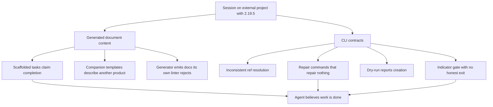

## prod_048_agent_facing_correctness_of_generated_docs_and_cli_contracts - Agent-facing correctness of generated docs and CLI contracts
> Date: 2026-08-01
> Status: Proposed
> Related request: (none yet)
> Related backlog: (none yet)
> Related task: (none yet)
> Related architecture: (none yet)
> Reminder: Update status, linked refs, scope, decisions, success signals, and open questions when you edit this doc.

# Overview
Field report from a full working session on an external project (`cts`, recruiting
dashboard) using `logics-manager 2.19.5` end to end: scaffolding four request
chains, auditing them for handoff, closing a roadmap, opening another, and
delivering one chain through `flow start` -> `flow progress` -> `flow closeout`.

The workflow model held up well. What did not hold up is the **content the tool
generates** and the **consistency of its CLI contracts**. Two classes of problem
dominated: generated documents that assert things that are false about the
project they describe, and commands whose accepted reference form, repair
behaviour, or success message does not match what they actually do.

This continues `prod_045_logics_operator_ergonomics`, which addressed operator
friction. The findings here are narrower and more serious: they are cases where
an agent that trusts the tool's output produces wrong work.



# Goals
- Make every generated document true about the project it is generated into, or
  visibly empty, never confidently wrong.
- Make one reference form work across every command that accepts a reference.
- Make advertised repair commands either fix the finding they are advertised for
  or stop advertising themselves.
- Give the "modified without updating indicators" gate an honest exit for
  semantic edits that do not change status.
- Make dry-run output distinguishable from applied output.

# Non-goals
- Changing the request -> backlog -> task -> product/roadmap workflow model,
  which worked well.
- Redesigning the CLI surface or renaming existing commands.
- Adding new document kinds.
- Changing lint or audit rule severity.

# Observed friction

Ordered by how much damage a trusting agent would do.

## 1. Scaffolded tasks declare themselves complete (highest severity)

Every task produced by `flow scaffold request-chain` contains, verbatim:

```
# AC Traceability
- request-AC1 -> This task. Proof: scaffold command generated the request-chain corpus.
- request-AC4 -> This task. Proof: optional context-pack handoff is supported.
- request-AC6 -> This task. Proof: dry-run and collision checks bound file changes.
- request-AC8 -> This task. Proof: CLI help documents the one-pass scaffold workflow.

# Validation
- Run `python3 -m logics_manager lint --require-status`.
- Run scaffold command tests.

# Report
- Implementation complete.
```

Three separate problems in one block:

- The AC traceability maps to **the scaffold command's own acceptance criteria**,
  not the request's. On a request with 14 ACs about candidate filters and mobile
  layout, the task claimed AC1/AC4/AC6/AC8 were satisfied by "CLI help documents
  the one-pass scaffold workflow".
- `# Report` says **"Implementation complete."** on a task at `Progress: 0%` and
  `Status: Ready`. An agent opening this task first reads a finished job.
- `# Validation` prescribes `python3 -m logics_manager lint` and "scaffold command
  tests" — the *tool's* verification, not the target project's. The target
  project's real gates (`npm test`, `lint`, `check:size`, `build`, `a11y`) are
  never mentioned.

This reproduced identically on all four tasks I inspected (`task_031` through
`task_034`), including two scaffolded by a different session. I hand-rewrote all
four. Suggested fix: emit `# Report\n- Not started.`, derive AC traceability from
the input's `backlog_items[].request_acs` (which the scaffold input already
carries and which I had to re-derive by hand), and either leave `# Validation`
empty or seed it from a project-level convention.

## 2. Companion templates describe an unrelated product

`flow companion architecture --title "Pipeline triage model for the New stage"`
produced a document whose entire body was about something else:

```
# Context
- The runtime is being consolidated into the main repo.
- Legacy skill/bootstrap boundaries are being retired.

# Decision
- Prefer a native Python runtime with a minimal plugin shell.

# Consequences
- The CLI becomes the primary operational surface.
```

This is Logics Manager's own architecture, leaked into a recruiting-product ADR.
100% of the generated body was discarded. An empty scaffold with section headers
would have been strictly more useful, because it would not have to be detected as
wrong first.

## 3. The generator emits documents its own linter rejects

The ADR created by `flow companion architecture` immediately failed
`logics-manager lint`:

```
- logics/architecture/adr_002_...md: missing indicator: Drivers
```

The generator does not emit a `> Drivers:` line; the linter requires it. Any
`companion architecture` call is followed by a guaranteed lint failure the caller
must fix by hand.

## 4. Advertised repair commands repair nothing

`audit` reported four `companion_doc_missing_mermaid` warnings. `flow repair
mermaid --refs <request-ref> --dry-run` returned:

```
Repair mermaid: would change 0 file(s).
```

Same for `flow repair ac-traceability <request-path> --dry-run` against tasks
carrying the boilerplate from finding 1 — `would change 0 file(s)`, while lint and
audit continued to flag them. I ended up writing five Mermaid diagrams and four AC
traceability blocks by hand.

Either these repairs should cover the findings that name them, or the findings
should not imply a repair exists.

## 5. Reference resolution differs per command, with misleading errors

The same logical reference is accepted, rejected, or unrecognised depending on the
subcommand:

| Command | Input | Result |
| --- | --- | --- |
| `flow validate` | a request full ref | works |
| `sync update-indicators` | a task full ref | works |
| `flow repair ac-traceability` | a task full ref | `Source not found` |
| `flow repair ac-traceability` | a task file path | `Expected source under logics/request` |
| `flow repair mermaid --refs` | a product-brief full ref | `Workflow source not found` |
| `flow repair mermaid --refs` | a product-brief file path | `Workflow source not found` |

The `Source not found` message for a document that plainly exists is the worst of
these: it says the document is missing when the real problem is that the command
only accepts requests. The path form eventually revealed that, but only after
three attempts. `--refs` is also plural and kind-agnostic in name while being
kind-restricted in behaviour.

## 6. Dry-run reports that it created things

```
$ logics-manager flow companion architecture --title "..." --dry-run
...
Created companion doc: logics/architecture/adr_002_....md
```

Nothing was written — I verified with `ls`. `flow roadmap propose --dry-run`
behaves the same way ("Created roadmap: ..."). An agent that trusts this message
will skip the real invocation and continue against a document that does not
exist. The dry-run path should say `Would create`, as `flow scaffold` correctly
does (`Would scaffold request chain: ...`).

## 7. The indicator gate has no honest exit for roadmaps

Editing a roadmap body triggers:

```
modified without updating indicators: Date, Related product, Related request, Reminder, Status
fix: logics-manager sync update-indicators <ref> --understanding <n> --confidence <n>
   ; or add `> Non-semantic edit:` for intentionally non-semantic edits
```

The suggested fix does not work: `--understanding` / `--confidence` are not in the
approved indicator set for roadmaps, so the gate stays red after running exactly
what it recommended. The remaining flags are `--status`, `--progress`, `--theme`,
`--complexity`; none applied, since the roadmap legitimately stayed `Active`.

That left only the `> Non-semantic edit:` marker — for a change that restructured
the milestone set. I used it and worded the marker to describe the restructuring
honestly, but the workflow pushed me to label a semantic edit as non-semantic.
A gate whose only satisfiable exit is a false statement is a correctness problem,
not an ergonomics one.

Related: `sync update-indicators <ref>` with no flags errors with `At least one
workflow indicator is required` instead of performing a no-op refresh, which is
what "I edited the body, re-baseline it" actually needs.

## 8. Indicator values must drift to satisfy the gate

`sync update-indicators` returns `changed: False` when passed the current values,
and the gate stays red. To clear it I had to invent numeric movement:
`90 -> 92 -> 93` on Understanding and `85 -> 88 -> 89` on Confidence across three
edits, none of which corresponded to a real change in understanding. These fields
degrade into edit counters. A dedicated `--touch` / re-baseline flag would remove
the incentive to fabricate.

## 9. `sync update-indicators` writes a different format than the templates

Templates and pre-existing docs use `> Understanding: 90%`. After
`sync update-indicators --understanding 92`, the doc reads `> Understanding: 92`,
with no `%`. The corpus now mixes both forms, and `INDEX.md` renders both.

## 10. Closeout preflight: the documented fix does not satisfy the check

`flow validate-closeout` reported:

```
validation_evidence_missing: `# Validation` has no concrete passing validation evidence
repair: python3 -m logics_manager flow closeout <task> --validation "... passed"
```

Running `flow closeout <task> --validation "npm test passed (26 assertions, 0
failures); npm run lint passed; ..."` failed with the **same** preflight error and
`changed files: 0`. What actually worked was hand-editing the `# Validation`
section from imperative form ("Run `npm test`...") into past-tense statements
("`npm test` passed on 2026-08-01: 26 assertions, 0 failures").

So the required shape is "past-tense lines inside the section", the `--validation`
flag does not write into that section in a way the checker accepts, and the
documented repair is a dead end. The check itself is good and caught a real gap —
only its remedy is wrong.

## 11. Status vocabularies are discoverable only through errors

There is no obvious way to ask which statuses a document kind accepts. I learned
the roadmap vocabulary by guessing wrong:

```
`Completed` is not a valid status for roadmap
(allowed: Draft, Proposed, Active, Accepted, Validated, Rejected, Superseded, Settled, Archived)
```

The error is excellent; the only way to reach it is to fail. Same for scaffold
input: `request.complexity` rejected `Small` and named the enum
(`Low, Medium, High`) only on failure.

## 12. `flow list` prints help in its documented default form

`logics-manager flow list` printed the usage block instead of a listing.
`logics-manager flow list --kind all` listed correctly. The help text's own first
example is `logics-manager flow list`.

## 13. A doc cannot quote a reference as an example

Writing this brief tripped the audit three times: the reference-form table above
originally quoted real-looking refs in backticks, and `companion_doc_refs_missing_target`
resolved them as genuine links to documents in another repository:

```
BLOCKING: [companion_doc_refs_missing_target] companion doc references missing target `<a request ref>`
```

Fenced code blocks are not an escape either: after fixing the table, the audit
still resolved the ref inside the fenced sample of its own error message above,
so quoting the diagnostic reproduced the diagnostic. Any document that discusses
references — a runbook, a convention note, this brief — cannot show one, in prose
or in a code block, without inventing an unresolvable link. I found no escape
syntax and ended up describing the forms instead of showing them, which makes the
table above less useful than it should be.

This also means the rule cannot distinguish "this document links to a missing
document" from "this document is about links". A brief written in one repository
about work in another can never satisfy it.

## 14. Roadmap milestone parsing silently drops non-numeric versions

I wrote four milestones, one labelled `## 0.9.S - Lot S: Security posture` to mark
a parallel track. `flow roadmap validate` returned `OK` with `milestones: 3`. No
warning named the dropped heading. A milestone invisible to the tooling is a
milestone that gets skipped; the count was the only clue, and only because I read
it. Renaming to `0.9.4` fixed it.

# Uncertainties I could not resolve

- Whether `flow repair ac-traceability` is meant to rewrite task traceability at
  all, or only to repair request-side links. The help text does not say, and
  `would change 0 file(s)` is ambiguous between "nothing to do" and "wrong kind
  of input".
- Whether `--validation` on `flow closeout` is supposed to write into
  `# Validation` or to record evidence elsewhere. It reported success on the flag
  while the preflight still failed.
- Whether the boilerplate in scaffolded tasks is intended as a placeholder that
  authors are expected to overwrite. If so, nothing in the output says so, and
  `Implementation complete.` is the wrong placeholder text in any case.
- Which indicators are "approved" per document kind. The gate lists them in its
  error, but I found no command that reports them up front.

# What worked well

Worth preserving; these carried the session.

- `flow scaffold request-chain` with `--context-pack` is a genuine multiplier: one
  JSON produced request, product brief, seven backlog slices, orchestration task,
  index entry, and a 19 KB handoff pack, with stable ids and correct cross-links.
- `--dry-run` on scaffold prints the exact file list before writing, and the
  message correctly says `Would scaffold`.
- `flow validate` returning `0 finding(s)` on a fresh chain, and `audit` reporting
  `0 blocking, 0 warnings` after cleanup, gave real confidence.
- The `modified without updating indicators` gate, whatever its exit problem,
  caught every hand edit I made. It works.
- Closeout preflight refused to close a task three times for legitimate reasons
  (unchecked plan items, no DoD evidence, no validation evidence). Without it I
  would have closed a task whose UI change had never been visually verified — and
  when I then produced the visual proof, it exposed a real CSS defect. That gate
  paid for itself.
- Error messages, when they fire, are specific and name the allowed values.

# Success signals

- A freshly scaffolded task can be handed to an agent with no hand editing, and
  nothing in it asserts work that has not happened.
- `flow companion architecture` and `flow companion product` produce documents
  that pass `logics-manager lint` immediately.
- Every reference accepted by `flow validate` is accepted by every other command
  that takes a reference, or the error explains the kind restriction.
- A dry-run never uses the past tense.
- A semantic body edit that does not change status can be re-baselined without
  inventing indicator drift and without labelling it non-semantic.
- `flow roadmap validate` reports every heading it did not parse as a milestone.

# Open questions

- Should scaffolded AC traceability be generated from `backlog_items[].request_acs`
  automatically? The data is already in the scaffold input, and re-deriving it by
  hand is exactly where I found two genuine coverage holes (a request AC covered
  by no backlog item, and an AC that required human action no agent can perform).
  Generating it would have surfaced those on day one.
- Is there value in a `logics-manager doctor <ref>` that reports, for one document,
  which indicators are approved, which statuses are valid, and which repairs apply?
  Most of my lost time was vocabulary discovery.

# References
- Session context: external project `cts` (recruiting dashboard), `logics-manager 2.19.5`,
  2026-08-01. Four request chains scaffolded and audited, one delivered end to end,
  one roadmap settled and one opened.
- Predecessor: `prod_045_logics_operator_ergonomics`.
