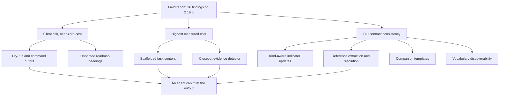

## prod_049_agent_facing_correctness_remediation - Agent-facing correctness remediation
> Date: 2026-08-01
> Status: Settled
> Related request: `req_300_agent_facing_correctness_of_generated_docs_and_cli_contracts`
> Related backlog: `item_573_make_dry_run_and_command_output_report_what_actually_happened`
> Related task: `task_297_orchestrate_agent_facing_correctness_remediation`
> Related architecture: (none yet)
> Reminder: Update status, linked refs, scope, decisions, success signals, and open questions when you edit this doc.

# Overview
Correct the generated content and CLI contract defects recorded in prod_048, so that an agent that trusts logics-manager output produces correct work rather than confidently wrong work.

# Goals
- Make every generated document true about the project it is generated into, or visibly empty.
- Make every command message an accurate report of what the command did.
- Make reference handling uniform across commands, with errors that name the real restriction.
- Give every gate an exit that is a true statement.
- Derive scaffolded traceability from data the input already carries, and surface the coverage holes that derivation exposes.

# Non-goals
- Changing the request, backlog, task, product and roadmap workflow model, which held up in the field.
- Redesigning the CLI surface or renaming existing commands.
- Adding new document kinds.
- Changing lint or audit rule severity.
- Adding a `doctor` command, which is deferred until these corrections land.
- Designing an escape syntax for citing references in running prose.

# Scope and guardrails
- In: scaffolded request, product, backlog, orchestration task, validation, and handoff context.
- Out: unrelated workflow docs and implementation of generated tasks.

# Key product decisions
- Use structured input as the source of truth for generated docs.
- Keep generated write paths local and repo-bounded.

# Success signals
- Generated docs pass lint and audit without broad manual rewrites.
- Context-pack output can be handed to an implementation agent directly.

# References
- Product back-reference: `item_573_make_dry_run_and_command_output_report_what_actually_happened`
- Task back-reference: `task_297_orchestrate_agent_facing_correctness_remediation`
