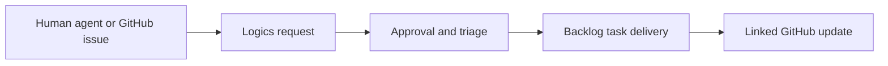

## prod_050_multi_channel_request_intake_and_github_issues_bridge - Multi-channel request intake and GitHub Issues bridge
> Date: 2026-08-04
> Status: Settled
> Related request: `req_301_create_a_multi_channel_request_intake_and_github_issues_bridge`
> Related backlog: `item_582_define_canonical_multi_channel_request_intake_and_provenance`
> Related task: `task_298_orchestrate_multi_channel_request_intake_and_github_issues_bridge_delivery`
> Related architecture: (none yet)
> Reminder: Update status, linked refs, scope, decisions, success signals, and open questions when you edit this doc.
> Indicators reviewed: 2026-08-04

# Overview
Make Logics the canonical request and delivery workspace for human, agent, and GitHub-originated work. GitHub Issues remains an optional external intake and communication channel, connected by deliberate links and guarded lifecycle updates rather than a broad synchronization layer.

# Goals
- Give people and AI agents a consistent way to submit and track requests in Logics.
- Turn approved GitHub issues into traceable Logics workflow work with minimal operator friction.
- Expose request provenance and linked GitHub state in the local and embedded viewers.
- Preserve operator control, local-first safety, and the existing canonical Logics lifecycle.

# Non-goals
- A hosted multi-tenant issue tracker or replacement for GitHub Issues.
- An unrestricted GitHub automation agent or unattended code execution from issue content.
- Full bidirectional mirroring of GitHub comments, edits, projects, milestones, and every status field.
- Changing behavior for repositories that do not opt into a GitHub bridge.

# Scope and guardrails
- In: scaffolded request, product, backlog, orchestration task, validation, and handoff context.
- Out: unrelated workflow docs and implementation of generated tasks.

# Key product decisions
- Use structured input as the source of truth for generated docs.
- Keep generated write paths local and repo-bounded.

# Success signals
- Generated docs pass lint and audit without broad manual rewrites.
- Context-pack output can be handed to an implementation agent directly.

# References
- Product back-reference: `item_582_define_canonical_multi_channel_request_intake_and_provenance`
- Task back-reference: `task_298_orchestrate_multi_channel_request_intake_and_github_issues_bridge_delivery`
