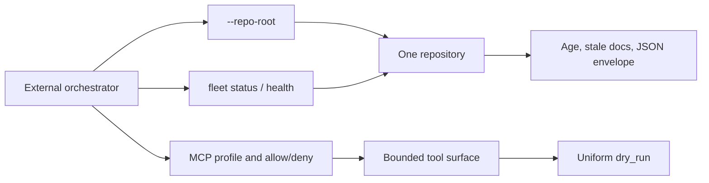

## prod_051_multi_repository_and_embedder_contract_for_the_logics_cli - Multi-repository and embedder contract for the Logics CLI
> Date: 2026-08-07
> Status: Settled
> Related request: `req_303_make_logics_manager_embeddable_by_external_orchestrators_across_multiple_repositories`
> Related backlog: `item_588_accept_an_explicit_repository_root_on_every_command`
> Related task: `task_300_orchestrate_the_multi_repository_and_embedder_contract_delivery`
> Related architecture: (none yet)
> Reminder: Update status, linked refs, scope, decisions, success signals, and open questions when you edit this doc.

# Overview
Make logics-manager a dependable building block for external orchestrators that drive Logics work across many repositories. The CLI gains explicit repository targeting, a bounded MCP surface, a uniform mutation and output contract, a trustworthy self-update, and the workflow-age signals callers currently reconstruct themselves, so an embedder writes configuration instead of glue.

# Goals
- Remove the working-directory constraint from every command surface.
- Let an operator expose exactly the tool capability an integration needs, and nothing more.
- Make mutation preview, machine-readable output, and exit codes consistent across the whole surface.
- Publish the workflow signals and delegation skills that embedders currently rebuild by hand.

# Non-goals
- Owning transport, scheduling, polling cadence, or notification delivery for an external orchestrator.
- Persisting cross-invocation state or diffing workflow snapshots between polling ticks.
- A hosted or daemonized multi-repository service.
- Changing the default behavior of existing single-repository invocations.

# Scope and guardrails
- In: scaffolded request, product, backlog, orchestration task, validation, and handoff context.
- Out: unrelated workflow docs and implementation of generated tasks.

# Key product decisions
- Use structured input as the source of truth for generated docs.
- Keep generated write paths local and repo-bounded.

# Success signals
- Generated docs pass lint and audit without broad manual rewrites.
- Context-pack output can be handed to an implementation agent directly.

# References
- Product back-reference: `item_588_accept_an_explicit_repository_root_on_every_command`
- Task back-reference: `task_300_orchestrate_the_multi_repository_and_embedder_contract_delivery`
