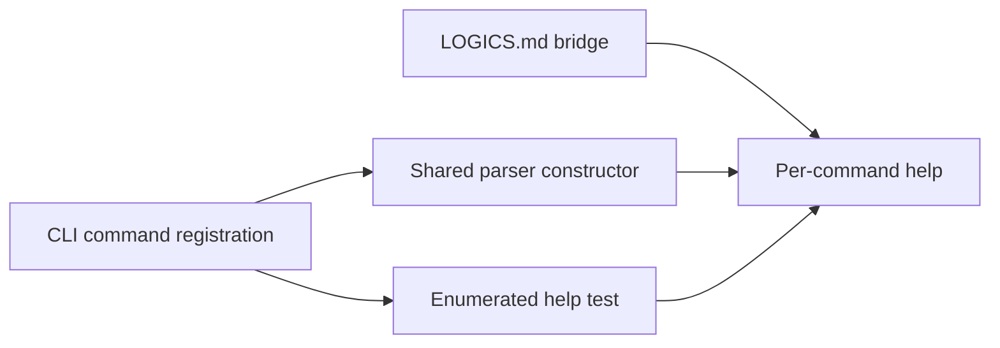

## prod_052_reliable_cli_help_and_command_contract_discovery - Reliable CLI help and command contract discovery
> Date: 2026-08-07
> Status: Settled
> Related request: `req_304_make_the_documented_per_command_help_contract_work_across_the_whole_cli_surface`
> Related backlog: `item_596_register_the_help_flag_at_the_shared_parser_construction_point`
> Related task: `task_301_restore_the_per_command_help_contract_across_the_cli_surface`
> Related architecture: (none yet)
> Reminder: Update status, linked refs, scope, decisions, success signals, and open questions when you edit this doc.

# Overview
Guarantee that the per-command help the generated instructions point to actually works, everywhere, and stays working as the command surface grows. Fix the defect where it is constructed rather than where it is observed, and enumerate the surface in a test so the next command cannot silently regress.

# Goals
- Make per-command help a dependable contract for operators and agents.
- Remove the class of defect rather than its current instances.
- Keep the command surface self-verifying as it grows.

# Non-goals
- Redesigning help text formatting or the top-level help layout.
- Adding a machine-readable description of the command surface.
- Changing command behavior, flags, or exit codes beyond the help flag.
- Migrating the CLI to a different argument-parsing framework.

# Scope and guardrails
- In: scaffolded request, product, backlog, orchestration task, validation, and handoff context.
- Out: unrelated workflow docs and implementation of generated tasks.

# Key product decisions
- Use structured input as the source of truth for generated docs.
- Keep generated write paths local and repo-bounded.

# Success signals
- Generated docs pass lint and audit without broad manual rewrites.
- Context-pack output can be handed to an implementation agent directly.

# References
- Product back-reference: `item_596_register_the_help_flag_at_the_shared_parser_construction_point`
- Task back-reference: `task_301_restore_the_per_command_help_contract_across_the_cli_surface`
