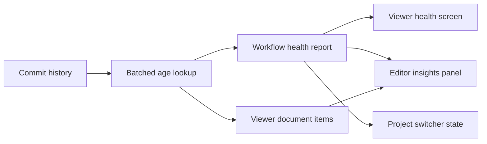

## prod_053_one_workflow_signal_every_logics_surface - One workflow signal, every Logics surface
> Date: 2026-08-07
> Status: Settled
> Related request: `req_305_give_the_viewer_surfaces_the_same_workflow_signals_the_cli_reports`
> Related backlog: `item_598_invalidate_the_document_age_cache_when_the_repository_moves`
> Related task: `task_302_orchestrate_viewer_parity_with_the_cli_workflow_signals`
> Related architecture: (none yet)
> Reminder: Update status, linked refs, scope, decisions, success signals, and open questions when you edit this doc.

# Overview
Make the browser viewer and the embedded editor panel report the same document age, the same staleness verdict, and the same workflow health as the CLI, from one implementation rather than three. Fix the caching defect that would otherwise freeze those signals in any long-running surface before wiring them up.

# Goals
- Report one age and one staleness verdict, whichever surface is asked.
- Give the viewer access to the workflow health report it currently cannot reach.
- Answer per-project state where a project is already being chosen.
- Leave exactly one implementation of each shared judgement behind.

# Non-goals
- A dedicated fleet screen: the project switcher is already where that question is asked.
- Exposing the served MCP tool profile in the viewer, since it is fixed at server launch and cannot be changed from there.
- Managing bundled skill installation from the viewer.
- A mutation-preview flow in the viewer: that is a user-experience change of its own, not signal parity.
- Changing the shape of existing viewer payload fields.

# Scope and guardrails
- In: scaffolded request, product, backlog, orchestration task, validation, and handoff context.
- Out: unrelated workflow docs and implementation of generated tasks.

# Key product decisions
- Use structured input as the source of truth for generated docs.
- Keep generated write paths local and repo-bounded.

# Success signals
- Generated docs pass lint and audit without broad manual rewrites.
- Context-pack output can be handed to an implementation agent directly.

# References
- Product back-reference: `item_598_invalidate_the_document_age_cache_when_the_repository_moves`
- Task back-reference: `task_302_orchestrate_viewer_parity_with_the_cli_workflow_signals`
