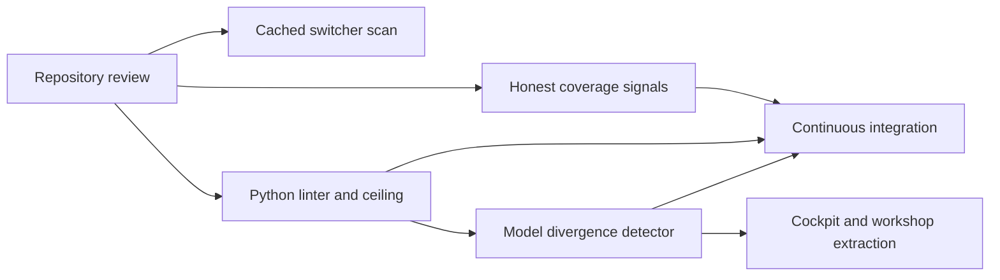

## prod_054_guardrails_proportionate_to_the_codebase - Guardrails proportionate to the codebase
> Date: 2026-08-07
> Status: Proposed
> Related request: `req_306_act_on_the_repository_review_measurement_honesty_guardrails_and_the_viewer_module_split`
> Related backlog: `item_603_cache_the_project_switcher_s_per_project_scan`, `item_604_make_the_coverage_signals_report_the_truth`, `item_605_add_a_python_linter_and_a_function_length_ceiling`, `item_606_detect_divergence_between_the_document_models`, `item_607_move_the_session_cockpit_and_workshop_routes_out_of_the_viewer_module`
> Related task: `task_303_orchestrate_the_repository_review_remediation`
> Related architecture: (none yet)
> Reminder: Update status, linked refs, scope, decisions, success signals, and open questions when you edit this doc.

# Overview
Make the repository's own quality signals trustworthy and automatic. Correct the measurements that report nothing or report something false, add the missing static guardrails, detect model divergence instead of merging models, and only then split the module that has grown past comfortable review.

# Goals
- Report measurements that are true, or stop implying they are taken.
- Catch a regression in continuous integration rather than in a later review.
- Prefer a detector over a refactor where the risk is divergence, not incorrectness.
- Bring the largest module back to a reviewable size without changing behavior.

# Non-goals
- Merging the document models into one: they serve different callers, they agree today, and a detector is the proportionate answer.
- Rewriting the existing long functions: a ceiling that prevents new ones is enough.
- Adding static type checking to a largely unannotated codebase.
- Restructuring the tests so the browser host bundle can be instrumented, for a number rather than for safety.
- Changing any runtime behavior during the module extraction.

# Scope and guardrails
- In: scaffolded request, product, backlog, orchestration task, validation, and handoff context.
- Out: unrelated workflow docs and implementation of generated tasks.

# Key product decisions
- Use structured input as the source of truth for generated docs.
- Keep generated write paths local and repo-bounded.

# Success signals
- Generated docs pass lint and audit without broad manual rewrites.
- Context-pack output can be handed to an implementation agent directly.

# References
- Product back-reference: `req_306_act_on_the_repository_review_measurement_honesty_guardrails_and_the_viewer_module_split`
- Task back-reference: `task_303_orchestrate_the_repository_review_remediation`
