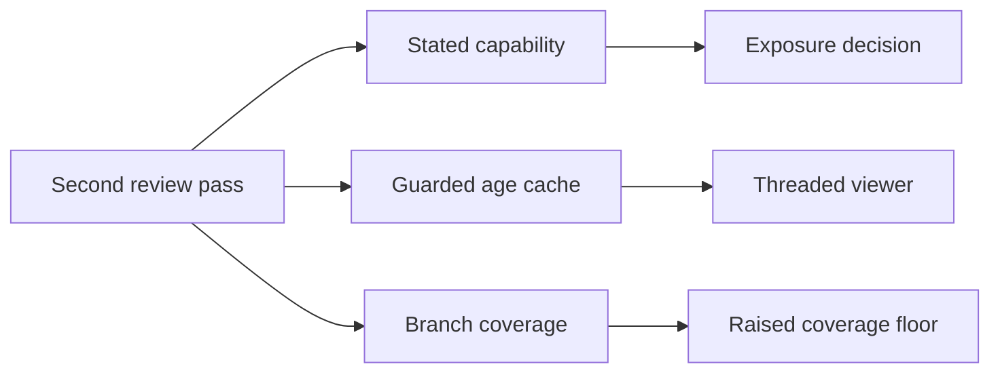

## prod_055_say_what_it_does_and_test_what_was_moved - Say what it does, and test what was moved
> Date: 2026-08-07
> Status: Proposed
> Related request: `req_307_close_the_gaps_the_second_review_found_stated_risk_cache_concurrency_and_untested_route_branches`
> Related backlog: `item_608_state_that_network_writes_grant_command_execution`, `item_609_make_the_document_age_lookup_safe_under_concurrency`, `item_610_cover_the_extracted_route_branches_and_the_fleet_report`
> Related task: `task_304_orchestrate_the_second_review_remediation`
> Related architecture: (none yet)
> Reminder: Update status, linked refs, scope, decisions, success signals, and open questions when you edit this doc.

# Overview
Make the viewer's documented risk match its real capability, make the shared age lookup safe in the threaded server it now runs inside, and cover the request branches a recent extraction exposed. Three narrow corrections behind one review pass, none of them changing what the software is allowed to do.

# Goals
- Let an exposure decision be made against the real capability.
- Remove duplicated work when concurrent requests arrive together.
- Exercise the branches that only a live request reaches.
- Leave every authorization rule exactly as it is.

# Non-goals
- Restricting or sandboxing what the workshop terminal can run: it is a terminal, and that is the feature.
- Changing the pairing, token, or origin mechanism, which the review found sound.
- Reworking the extracted modules beyond adding tests.
- Raising coverage floors for modules this request does not touch.

# Scope and guardrails
- In: scaffolded request, product, backlog, orchestration task, validation, and handoff context.
- Out: unrelated workflow docs and implementation of generated tasks.

# Key product decisions
- Use structured input as the source of truth for generated docs.
- Keep generated write paths local and repo-bounded.

# Success signals
- Generated docs pass lint and audit without broad manual rewrites.
- Context-pack output can be handed to an implementation agent directly.

# References
- Product back-reference: `req_307_close_the_gaps_the_second_review_found_stated_risk_cache_concurrency_and_untested_route_branches`
- Task back-reference: `task_304_orchestrate_the_second_review_remediation`
