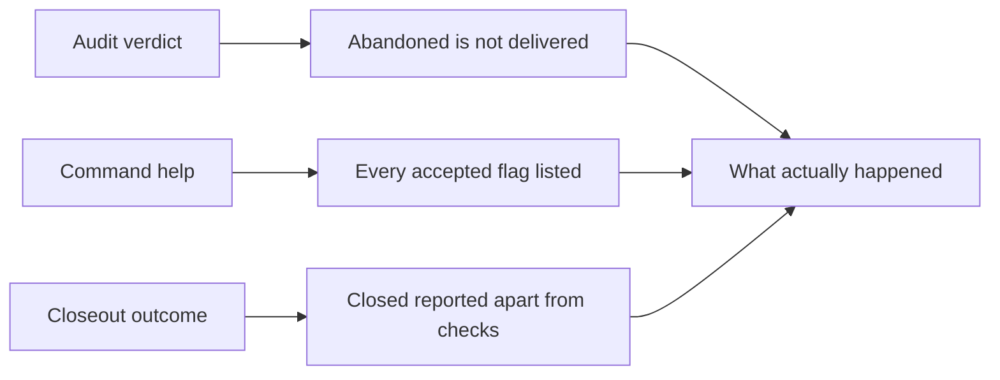

## prod_056_say_what_actually_happened - Say what actually happened
> Date: 2026-08-08
> Status: Settled
> Related request: `req_308_report_workflow_outcomes_honestly_across_audit_help_and_closeout`
> Related backlog: `item_611_stop_asking_abandoned_requests_for_an_implementation_chain`
> Related task: `task_305_orchestrate_the_honest_outcome_corrections`
> Related architecture: (none yet)
> Reminder: Update status, linked refs, scope, decisions, success signals, and open questions when you edit this doc.
> Indicators reviewed: 2026-08-08

# Overview
Three narrow corrections to surfaces that report something other than the truth: an audit that treats an abandoned request as an undelivered one, a help screen that omits a flag the tool recommends, and a closeout that reports failure after succeeding. None of them change what the tooling permits; each of them changes what it says.

# Goals
- Let a terminal status mean what it says, so abandoning work is a supported ending and not a permanent finding.
- Let a command's help be the answer to what that command accepts.
- Let a caller act on an outcome without reconstructing it from the rest of the payload.
- Leave every existing rule about delivered work exactly as strict as it is.

# Non-goals
- Reworking the status vocabulary or introducing new statuses.
- Relaxing any check on requests that were actually delivered.
- Preflighting the repository-wide audit before closeout mutates, which would let an unrelated corpus block every closeout.
- Replacing the hand-authored parts of the help screens: their summaries, usage lines, accepted values and examples stay written by hand.

# Scope and guardrails
- In: scaffolded request, product, backlog, orchestration task, validation, and handoff context.
- Out: unrelated workflow docs and implementation of generated tasks.

# Key product decisions
- Use structured input as the source of truth for generated docs.
- Keep generated write paths local and repo-bounded.

# Success signals
- Generated docs pass lint and audit without broad manual rewrites.
- Context-pack output can be handed to an implementation agent directly.

# References
- Product back-reference: `item_611_stop_asking_abandoned_requests_for_an_implementation_chain`
- Task back-reference: `task_305_orchestrate_the_honest_outcome_corrections`
