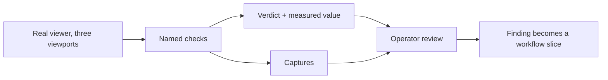

## prod_057_a_viewer_campaign_that_reports_what_it_saw - A viewer campaign that reports what it saw
> Date: 2026-08-08
> Status: Proposed
> Related request: `req_309_turn_the_viewer_visual_smoke_into_a_ui_campaign_that_reports_what_it_measured`
> Related backlog: `item_615_make_the_viewer_campaign_report_every_check_with_its_measured_value`, `item_616_assert_the_layout_defects_a_passing_unit_suite_cannot_see`, `item_617_write_the_campaign_runbook_and_say_where_a_finding_goes`
> Related task: `task_306_orchestrate_the_viewer_ui_campaign`
> Related architecture: (none yet)
> Reminder: Update status, linked refs, scope, decisions, success signals, and open questions when you edit this doc.
> Indicators reviewed: 2026-08-08

# Overview
Turn the existing viewer visual smoke into a campaign: it keeps gating a delivery, and it also becomes readable. Every check is named and reported with the value it measured, a failure no longer hides the checks behind it, and the assertions grow to cover the layout defects a green unit suite is blind to. One campaign, driven against the standalone viewer, covers the interface both the viewer and the extension render.

# Goals
- Make a run readable after the fact, not only pass or fail.
- Catch the defects that only appear when the real interface is drawn at a real size.
- Keep the campaign honest about coverage by deriving its lists from the interface.
- Reuse the machinery that already exists rather than adding a browser-automation dependency.

# Non-goals
- Adding a browser-automation framework: the debugging-protocol driver already in place stays.
- A second campaign for the extension webview, which renders the same source.
- Comparing captures against golden images, which would fail on every legitimate document change.
- Judging whether a screen reads well, which stays an attended pass by a human.
- Publishing captures anywhere outside the ignored artifacts directory.

# Scope and guardrails
- In: scaffolded request, product, backlog, orchestration task, validation, and handoff context.
- Out: unrelated workflow docs and implementation of generated tasks.

# Key product decisions
- Use structured input as the source of truth for generated docs.
- Keep generated write paths local and repo-bounded.

# Success signals
- Generated docs pass lint and audit without broad manual rewrites.
- Context-pack output can be handed to an implementation agent directly.

# References
- Product back-reference: `req_309_turn_the_viewer_visual_smoke_into_a_ui_campaign_that_reports_what_it_measured`
- Task back-reference: `task_306_orchestrate_the_viewer_ui_campaign`
