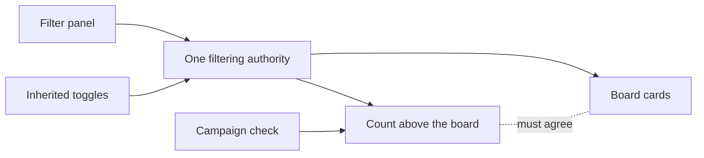

## prod_058_a_filter_that_means_the_board - A filter that means the board
> Date: 2026-08-08
> Status: Settled
> Related request: `req_310_make_the_board_filters_answer_with_what_the_board_actually_shows`
> Related backlog: `item_619_give_the_viewer_one_filtering_authority`
> Related task: `task_307_orchestrate_the_board_filter_corrections`
> Related architecture: (none yet)
> Reminder: Update status, linked refs, scope, decisions, success signals, and open questions when you edit this doc.
> Indicators reviewed: 2026-08-08 17:22:09

# Overview
The board applies two filtering systems in series and reports on only one of them, so on a finished corpus the count promises hundreds of documents above an empty board. Give the viewer one filtering authority, make the count ask the same question the board asks, and let the campaign fail when the two disagree.

# Goals
- Make a filter selection the thing that decides what is shown.
- Make the number above the board describe the board.
- Make an option that can return nothing say so instead of looking broken.
- Leave the extension webview, which has no panel, filtering as it does today.

# Non-goals
- Redesigning the filter panel or adding filter dimensions.
- Removing the inherited toggles from the extension webview, which is where they are still the only filtering there is.
- Changing how the board groups, sorts, or pages its cards.
- Changing which documents the viewer loads.

# Scope and guardrails
- In: scaffolded request, product, backlog, orchestration task, validation, and handoff context.
- Out: unrelated workflow docs and implementation of generated tasks.

# Key product decisions
- Use structured input as the source of truth for generated docs.
- Keep generated write paths local and repo-bounded.

# Success signals
- Generated docs pass lint and audit without broad manual rewrites.
- Context-pack output can be handed to an implementation agent directly.

# References
- Product back-reference: `item_619_give_the_viewer_one_filtering_authority`
- Task back-reference: `task_307_orchestrate_the_board_filter_corrections`
