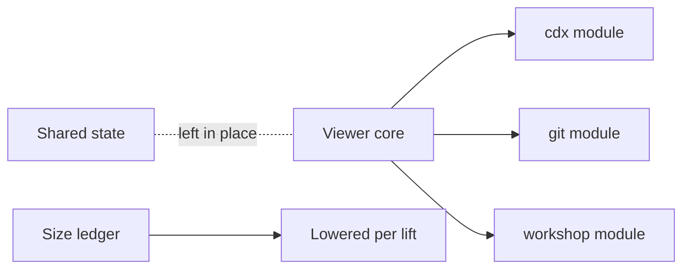

## prod_059_sub_systems_beside_the_core_not_inside_it - Sub-systems beside the core, not inside it
> Date: 2026-08-08
> Status: Settled
> Related request: `req_311_lift_the_viewer_s_sub_systems_out_of_its_core_and_turn_the_size_ledger_into_a_ratchet`
> Related backlog: `item_623_lift_cdx_and_git_out_of_the_viewer_server`
> Related task: `task_308_orchestrate_lifting_the_sub_systems_out_of_the_core`
> Related architecture: (none yet)
> Reminder: Update status, linked refs, scope, decisions, success signals, and open questions when you edit this doc.
> Indicators reviewed: 2026-08-08 17:22:09

# Overview
Three sub-systems -- cdx, git, and the workshop -- account for most of the viewer's mass on both sides of the wire, written inside the viewer core rather than beside it. Lift them into their own modules without changing behavior, cut the flow entry module by verb, and make the size ledger a ratchet that only comes down.

# Goals
- Let a sub-system be read and changed on its own.
- Shrink the core to what is actually the viewer.
- Make each delivery lower the ledger instead of raising it.
- Prove every move is behavior-free, in a codebase where nothing else would.

# Non-goals
- Moving the browser host's shared state, which a previous pass stopped at deliberately.
- Splitting the assistant adapter, whose extraction was tried and backed out for a recorded reason.
- Splitting test files, which follow the shape of what they test.
- Rewriting or improving any lifted sub-system while moving it.
- Lowering the 1000-line budget itself.

# Scope and guardrails
- In: scaffolded request, product, backlog, orchestration task, validation, and handoff context.
- Out: unrelated workflow docs and implementation of generated tasks.

# Key product decisions
- Use structured input as the source of truth for generated docs.
- Keep generated write paths local and repo-bounded.

# Success signals
- Generated docs pass lint and audit without broad manual rewrites.
- Context-pack output can be handed to an implementation agent directly.

# References
- Product back-reference: `item_623_lift_cdx_and_git_out_of_the_viewer_server`
- Task back-reference: `task_308_orchestrate_lifting_the_sub_systems_out_of_the_core`
