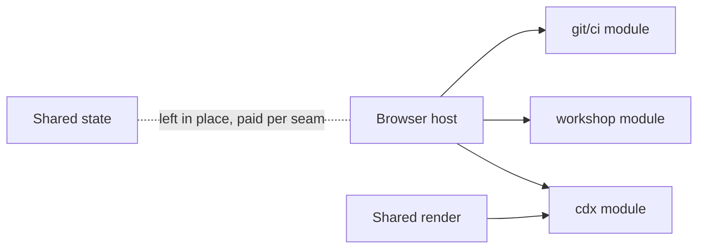

## prod_060_the_browser_host_down_to_the_viewer - The browser host, down to the viewer
> Date: 2026-08-08
> Status: Settled
> Related request: `req_312_finish_lifting_the_browser_host_s_sub_systems_on_the_seam_cdx_proved`
> Related backlog: `item_627_move_the_cdx_rendering_to_the_cdx_screen`
> Related task: `task_309_orchestrate_finishing_the_browser_host_split`
> Related architecture: (none yet)
> Reminder: Update status, linked refs, scope, decisions, success signals, and open questions when you edit this doc.
> Indicators reviewed: 2026-08-08 19:06:53

# Overview
Three more lifts on the seam the cdx screen proved: its rendering follows it out of the shared render module, then the workshop, then git and CI. Each is measured before it is moved, each is verified by the campaign as well as the suite, and each lowers the ledger. The host's shared state stays where it is, and the accessor each lift pays for it is the honest price of leaving it there.

# Goals
- Let a sub-system be read and changed on its own, rendering included.
- Bring the host down to what is actually the viewer.
- Keep every move provably behavior-free.
- Leave the shared state to a request that means to face it.

# Non-goals
- Rewriting or renaming the host's shared bindings.
- Splitting the document and project surfaces, which are small enough to stay.
- Splitting the assistant adapter, whose extraction was tried and backed out for a recorded reason.
- Changing any lifted sub-system's behavior while moving it.
- Lowering the line budget itself.

# Scope and guardrails
- In: scaffolded request, product, backlog, orchestration task, validation, and handoff context.
- Out: unrelated workflow docs and implementation of generated tasks.

# Key product decisions
- Use structured input as the source of truth for generated docs.
- Keep generated write paths local and repo-bounded.

# Success signals
- Generated docs pass lint and audit without broad manual rewrites.
- Context-pack output can be handed to an implementation agent directly.

# References
- Product back-reference: `item_627_move_the_cdx_rendering_to_the_cdx_screen`
- Task back-reference: `task_309_orchestrate_finishing_the_browser_host_split`
