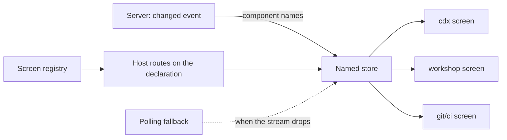

## prod_061_the_architecture_written_down - The architecture, written down
> Date: 2026-08-08
> Status: Proposed
> Related request: `req_313_write_down_the_architecture_the_viewer_already_has_a_named_store_server_driven_invalidation_declared_screens`
> Related backlog: `item_630_name_the_viewer_s_shared_state`, `item_631_let_the_server_s_change_notice_invalidate_the_cache`, `item_632_let_a_screen_declare_itself`
> Related task: `task_310_orchestrate_naming_the_viewer_architecture`
> Related architecture: (none yet)
> Reminder: Update status, linked refs, scope, decisions, success signals, and open questions when you edit this doc.
> Indicators reviewed: 2026-08-08 22:30:36

# Overview
The viewer already has an architecture: screens with private state over shared session state, invalidated by a change notice the server already streams. It is just implemented by hand, three times, and half-used. Name the store, let the server's notice drive the cache, and let screens declare themselves -- assembling what is present rather than importing something new.

# Goals
- Make the structure the lifts revealed explicit, so the next screen costs one declaration.
- Let staleness be told rather than guessed.
- Keep every phase independently shippable and independently verified.
- Change nothing the extension webview depends on.

# Non-goals
- Adopting a framework or Web Components: the content policy and the shared bundle rule out a new runtime, and the payoff would be comfort, not correctness.
- Replacing the rendering model of HTML strings and event delegation.
- Adding an endpoint: the change channel and its component vocabulary already exist.
- Removing the polling fallback, which exists because the stream drops on real networks.
- Splitting further by sub-system: what remains in the host is the viewer.

# Scope and guardrails
- In: scaffolded request, product, backlog, orchestration task, validation, and handoff context.
- Out: unrelated workflow docs and implementation of generated tasks.

# Key product decisions
- Use structured input as the source of truth for generated docs.
- Keep generated write paths local and repo-bounded.

# Success signals
- Generated docs pass lint and audit without broad manual rewrites.
- Context-pack output can be handed to an implementation agent directly.

# References
- Product back-reference: `req_313_write_down_the_architecture_the_viewer_already_has_a_named_store_server_driven_invalidation_declared_screens`
- Task back-reference: `task_310_orchestrate_naming_the_viewer_architecture`
