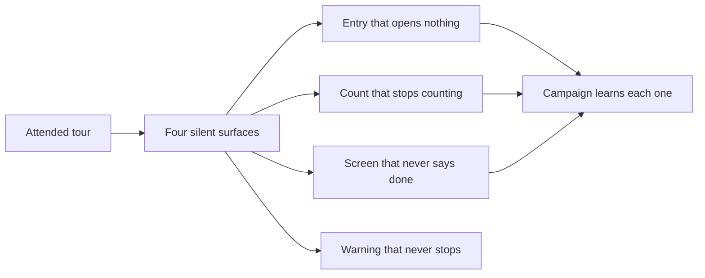

## prod_062_say_what_just_happened - Say what just happened
> Date: 2026-08-08
> Status: Settled
> Related request: `req_314_close_what_the_attended_tour_found_say_what_is_unavailable_count_what_is_shown_report_when_a_screen_is_done`
> Related backlog: `item_633_say_what_is_unavailable_before_it_is_chosen`
> Related task: `task_311_orchestrate_the_attended_tour_findings`
> Related architecture: (none yet)
> Reminder: Update status, linked refs, scope, decisions, success signals, and open questions when you edit this doc.
> Indicators reviewed: 2026-08-08 22:43:12

# Overview
An attended walk of the viewer found four surfaces that stay silent about what they did: two menu entries that open nothing, a count that stops counting when you search, screens that never report completion, and a warning that never goes away. Each is small; together they are the same defect the last three requests kept finding, on the surfaces a passing suite cannot see.

# Goals
- Make an unavailable action say so before it is chosen.
- Make the number above the board describe the board, under every filter.
- Make a finished screen say it is finished.
- Teach the campaign to catch all of it, since it was green on all of it.

# Non-goals
- Building the i18n or theme screens themselves, which is a separate feature.
- Removing the PATH warning, which reports a real risk.
- Changing how the board groups or sorts its columns.
- Reworking the status bar's design beyond what these findings require.

# Scope and guardrails
- In: scaffolded request, product, backlog, orchestration task, validation, and handoff context.
- Out: unrelated workflow docs and implementation of generated tasks.

# Key product decisions
- Use structured input as the source of truth for generated docs.
- Keep generated write paths local and repo-bounded.

# Success signals
- Generated docs pass lint and audit without broad manual rewrites.
- Context-pack output can be handed to an implementation agent directly.

# References
- Product back-reference: `item_633_say_what_is_unavailable_before_it_is_chosen`
- Task back-reference: `task_311_orchestrate_the_attended_tour_findings`
