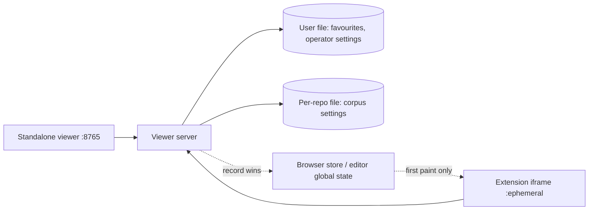

## prod_063_preferences_that_outlive_the_port - Preferences that outlive the port
> Date: 2026-08-08
> Status: Settled
> Related request: `req_315_persist_viewer_preferences_where_they_belong_favourites_for_the_user_the_rest_for_the_repository`
> Related backlog: `item_638_give_the_viewer_a_preference_store_that_does_not_depend_on_the_port`
> Related task: `task_312_orchestrate_moving_the_viewer_preferences_off_the_port`
> Related architecture: (none yet)
> Reminder: Update status, linked refs, scope, decisions, success signals, and open questions when you edit this doc.
> Indicators reviewed: 2026-08-08 23:02:41

# Overview
Viewer preferences live in browser storage, which is scoped to an origin, and the extension serves the viewer from a new port every session. Nothing is broken; everything is filed under a name that changes. Move the record to the server, which already knows both the repository and the machine: favourites and operator settings for the user, corpus settings for the repository, with the browser store kept only as a cache.

# Goals
- Make a favourite outlive the window that starred it.
- Keep a corpus's settings with the corpus.
- Let two open windows agree rather than overwrite each other.
- Stop a changing port from deciding what an operator gets to keep.

# Non-goals
- Syncing preferences between machines through the editor's settings sync, which would need a second store and a precedence rule; this request is about one machine and several windows.
- Fixing the extension's port, which would make two projects share one browser store and merge their corpus settings silently.
- Making the editor's global state the record: it cannot be read by the standalone viewer.
- Adding new preferences or changing what any existing one means.

# Scope and guardrails
- In: scaffolded request, product, backlog, orchestration task, validation, and handoff context.
- Out: unrelated workflow docs and implementation of generated tasks.

# Key product decisions
- Use structured input as the source of truth for generated docs.
- Keep generated write paths local and repo-bounded.

# Success signals
- Generated docs pass lint and audit without broad manual rewrites.
- Context-pack output can be handed to an implementation agent directly.

# References
- Product back-reference: `item_638_give_the_viewer_a_preference_store_that_does_not_depend_on_the_port`
- Task back-reference: `task_312_orchestrate_moving_the_viewer_preferences_off_the_port`
