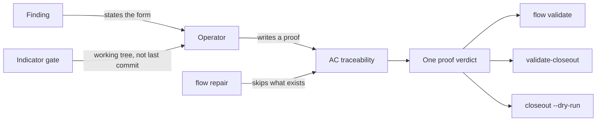

## prod_064_a_gate_you_can_satisfy - A gate you can satisfy
> Date: 2026-08-08
> Status: Settled
> Related request: `req_316_make_the_closeout_gate_teachable_self_consistent_and_non_destructive`
> Related backlog: `item_642_say_what_a_proof_looks_like_and_produce_one_that_passes`
> Related task: `task_313_orchestrate_making_the_closeout_gate_satisfiable`
> Related architecture: (none yet)
> Reminder: Update status, linked refs, scope, decisions, success signals, and open questions when you edit this doc.
> Indicators reviewed: 2026-08-08 23:08:24

# Overview
The closeout gate asks for something it never describes, answers the same question three ways, cannot be cleared on a committed document, and overwrites the answer an operator wrote by hand. Four field reports, one surface. Make it state its format, derive its verdict once, be clearable by following its own advice, and never destroy authored work.

# Goals
- Let the finding teach the format instead of the repair having to be reverse-engineered.
- Give one answer to whether a request can be closed.
- Make the recommended remediation actually remediate.
- Keep what an operator wrote.

# Non-goals
- Relaxing what counts as a proof: the gate exists because traceability is worth checking.
- Changing the proof format itself, which is fine once it is stated. Only its discoverability and its producers are in scope.
- Reworking the closeout chain's rollback behavior, which was changed recently and is not implicated here.
- Extending the gate to new document kinds.

# Scope and guardrails
- In: scaffolded request, product, backlog, orchestration task, validation, and handoff context.
- Out: unrelated workflow docs and implementation of generated tasks.

# Key product decisions
- Use structured input as the source of truth for generated docs.
- Keep generated write paths local and repo-bounded.

# Success signals
- Generated docs pass lint and audit without broad manual rewrites.
- Context-pack output can be handed to an implementation agent directly.

# References
- Product back-reference: `item_642_say_what_a_proof_looks_like_and_produce_one_that_passes`
- Task back-reference: `task_313_orchestrate_making_the_closeout_gate_satisfiable`
