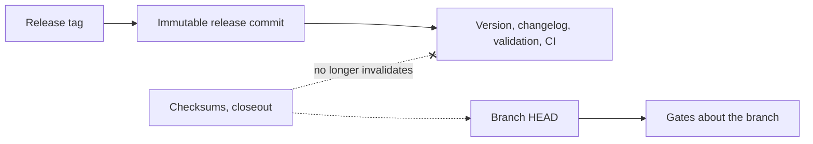

## prod_065_evidence_about_the_release - Evidence about the release
> Date: 2026-08-09
> Status: Proposed
> Related request: `req_317_judge_release_evidence_against_the_commit_the_release_was_cut_from`
> Related backlog: `item_647_compare_release_tree_evidence_against_the_tagged_commit`, `item_648_say_which_gates_are_about_the_branch_and_which_about_the_release`
> Related task: `task_314_orchestrate_judging_evidence_against_the_release`
> Related architecture: (none yet)
> Reminder: Update status, linked refs, scope, decisions, success signals, and open questions when you edit this doc.
> Indicators reviewed: 2026-08-09 00:55:27

# Overview
Release evidence is pinned to a commit and compared against whatever `HEAD` happens to be, so the commits the release process itself creates invalidate the gates that release just passed. Compare against the commit the tag points at -- immutable, and the thing the artifacts were built from -- and say which gates, if any, are deliberately about the branch instead.

# Goals
- Make a green release a fact about what was published, not a snapshot of a moment.
- Let the publish-then-close sequence terminate.
- Keep a release in preparation, before any tag, working as it does today.
- Say which comparison each gate makes, rather than leaving it to be discovered.

# Non-goals
- Relaxing what evidence a gate requires: the gates exist because the claims are worth checking.
- Changing how evidence is recorded, or its format.
- Changing the publication gates, which already match against the tag and are not implicated.
- Removing the checksum write-back or the closeout the release process asks for, which are both deliberate.

# Scope and guardrails
- In: scaffolded request, product, backlog, orchestration task, validation, and handoff context.
- Out: unrelated workflow docs and implementation of generated tasks.

# Key product decisions
- Use structured input as the source of truth for generated docs.
- Keep generated write paths local and repo-bounded.

# Success signals
- Generated docs pass lint and audit without broad manual rewrites.
- Context-pack output can be handed to an implementation agent directly.

# References
- Product back-reference: `req_317_judge_release_evidence_against_the_commit_the_release_was_cut_from`
- Task back-reference: `task_314_orchestrate_judging_evidence_against_the_release`
