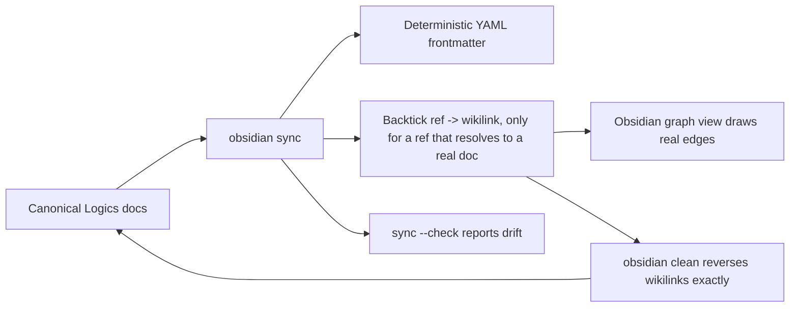

## prod_067_obsidian_as_a_supported_graph_navigable_visualization_surface_for_logics_corpora - Obsidian as a supported graph-navigable visualization surface for Logics corpora
> Date: 2026-08-09
> Status: Settled
> Related request: `req_319_standardize_the_obsidian_projection_into_a_graph_navigable_visualization_surface`
> Related backlog: `item_658_generate_reversible_wikilinks_in_the_obsidian_projection`
> Related task: `task_316_orchestrate_the_obsidian_graph_navigable_projection`
> Related architecture: (none yet)
> Reminder: Update status, linked refs, scope, decisions, success signals, and open questions when you edit this doc.

# Overview
Turn the existing opt-in Obsidian projection from frontmatter-only metadata into a real graph-navigable view of a Logics corpus, by generating deterministic, reversible wikilinks between cross-referencing docs, and documenting it as a first-class optional visualization surface alongside the CLI and the browser viewer.

# Goals
- Cross-doc refs projected as Obsidian wikilinks, so the graph view reflects actual corpus structure (request -> product -> backlog -> task).
- Round-trip safety: sync then clean is a no-op on the canonical body.
- Drift detection covers wikilinks, not just frontmatter.
- Direct test coverage for the projection logic, which has none today.
- Docs describe Obsidian as a supported visualization option, not a speculative one.

# Non-goals
- Building a custom Obsidian plugin.
- Generating Obsidian Canvas (.canvas) board files.
- Any auto-launch or auto-open integration with Obsidian.
- Replacing or duplicating logics/INDEX.md as a navigation entry point; it is reused as-is.
- Any change to canonical files under logics/; this only affects the derived opt-in projection.

# Scope and guardrails
- In: scaffolded request, product, backlog, orchestration task, validation, and handoff context.
- Out: unrelated workflow docs and implementation of generated tasks.

# Key product decisions
- Use structured input as the source of truth for generated docs.
- Keep generated write paths local and repo-bounded.

# Success signals
- Generated docs pass lint and audit without broad manual rewrites.
- Context-pack output can be handed to an implementation agent directly.

# References
- Product back-reference: `item_658_generate_reversible_wikilinks_in_the_obsidian_projection`
- Task back-reference: `task_316_orchestrate_the_obsidian_graph_navigable_projection`
