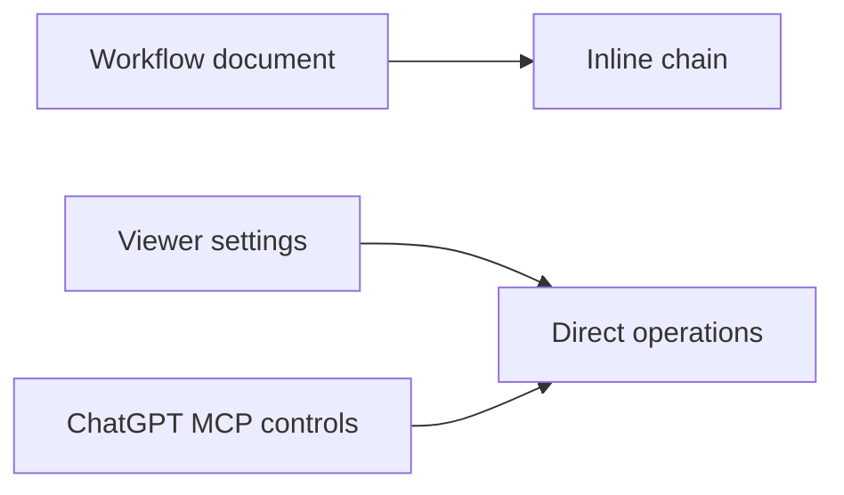

## prod_071_direct_viewer_operations_for_workflow_chains_and_chatgpt_mcp - Direct viewer operations for workflow chains and ChatGPT MCP
> Date: 2026-08-10
> Status: Settled
> Related request: `req_327_make_viewer_navigation_and_chatgpt_mcp_developer_controls_direct`
> Related backlog: `item_681_embed_the_bounded_workflow_chain_in_document_detail`
> Related task: `task_324_deliver_direct_viewer_chain_settings_and_chatgpt_mcp_controls`
> Related architecture: (none yet)
> Reminder: Update status, linked refs, scope, decisions, success signals, and open questions when you edit this doc.
> Indicators reviewed: 2026-08-10 12:29:03

# Overview
Make the viewer the compact operational surface for understanding a workflow chain, configuring viewer behavior, and deliberately connecting a project to ChatGPT developer mode through the existing local-first MCP tooling.

# Goals
- Keep workflow context visible without navigation churn.
- Make viewer configuration understandable as it grows.
- Make ChatGPT MCP startup, shutdown, URL copying, and security state explicit per project.
- Reuse the established MCP HTTP and tunnel lifecycle.

# Non-goals
- Create a new MCP transport, tunnel provider, or ChatGPT agent.
- Automatically expose a project to ChatGPT when the viewer opens.
- Render an unbounded corpus graph.
- Redesign unrelated Workshop, Remote, or CDX screens.

# Scope and guardrails
- In: scaffolded request, product, backlog, orchestration task, validation, and handoff context.
- Out: unrelated workflow docs and implementation of generated tasks.

# Key product decisions
- Use structured input as the source of truth for generated docs.
- Keep generated write paths local and repo-bounded.
- Keep the bounded chain visible by default in a compact, height-limited document frame.
- Present Settings as a dedicated card-based screen; keep the topbar button as its entry point.
- Place explicit ChatGPT Developer Mode controls immediately after Server in Settings, and never display connection secrets by default.

# Success signals
- Generated docs pass lint and audit without broad manual rewrites.
- Context-pack output can be handed to an implementation agent directly.

# References
- Product back-reference: `item_681_embed_the_bounded_workflow_chain_in_document_detail`
- Task back-reference: `task_324_deliver_direct_viewer_chain_settings_and_chatgpt_mcp_controls`
