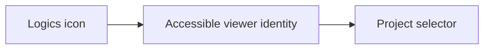

## prod_072_compact_logics_viewer_identity - Compact Logics viewer identity
> Date: 2026-08-10
> Status: Proposed
> Related request: `req_328_replace_the_viewer_title_with_a_compact_logics_logo`
> Related backlog: `item_684_use_the_logics_icon_as_the_viewer_topbar_identity`
> Related task: `task_325_deliver_compact_viewer_logo_identity`
> Related architecture: (none yet)
> Reminder: Update status, linked refs, scope, decisions, success signals, and open questions when you edit this doc.

# Overview
Use the existing Logics icon as the viewer identity in the topbar, reducing visual noise while preserving accessible navigation and the existing layout rhythm.

# Goals
- Make the topbar identity more discreet.
- Reuse the packaged icon rather than add a new asset.
- Keep layout and accessibility stable.

# Non-goals
- Redesign the rest of the viewer topbar.
- Change the project selector behavior.
- Introduce a new branding system or icon format.

# Scope and guardrails
- In: scaffolded request, product, backlog, orchestration task, validation, and handoff context.
- Out: unrelated workflow docs and implementation of generated tasks.

# Key product decisions
- Use structured input as the source of truth for generated docs.
- Keep generated write paths local and repo-bounded.

# Success signals
- Generated docs pass lint and audit without broad manual rewrites.
- Context-pack output can be handed to an implementation agent directly.

# References
- Product back-reference: `req_328_replace_the_viewer_title_with_a_compact_logics_logo`
- Task back-reference: `task_325_deliver_compact_viewer_logo_identity`
