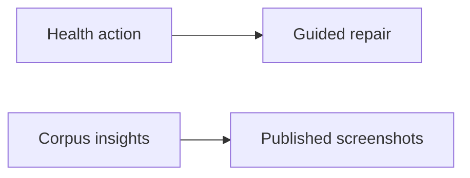

## prod_073_visible_viewer_operational_health - Visible viewer operational health
> Date: 2026-08-10
> Status: Settled
> Related request: `req_329_polish_viewer_health_actions_and_document_operational_views`
> Related backlog: `item_685_style_the_viewer_health_apply_fixes_action`, `item_686_add_health_and_insights_screenshots_to_the_readme`
> Related task: `task_326_deliver_health_action_polish_and_operational_viewer_documentation`
> Related architecture: (none yet)
> Reminder: Update status, linked refs, scope, decisions, success signals, and open questions when you edit this doc.

# Overview
Make the Health action feel deliberate and make the README show that the viewer helps operators understand and repair workflow state, not merely browse Markdown.

# Goals
- Give the repair action a clear, consistent visual affordance.
- Show Health and Insights in concise, publishable screenshots.
- Keep example imagery anonymized and readable.

# Non-goals
- Redesign Health or Insights data models.
- Change which deterministic fixes are available.
- Add an image gallery or marketing site.

# Scope and guardrails
- In: scaffolded request, product, backlog, orchestration task, validation, and handoff context.
- Out: unrelated workflow docs and implementation of generated tasks.

# Key product decisions
- Use structured input as the source of truth for generated docs.
- Keep generated write paths local and repo-bounded.

# Success signals
- Generated docs pass lint and audit without broad manual rewrites.
- Context-pack output can be handed to an implementation agent directly.

# References
- Product back-reference: `req_329_polish_viewer_health_actions_and_document_operational_views`
- Task back-reference: `task_326_deliver_health_action_polish_and_operational_viewer_documentation`
