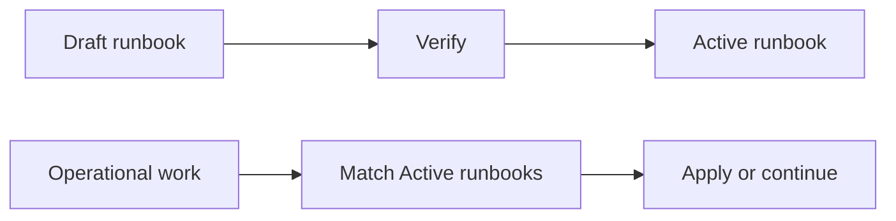

## prod_074_a_discoverable_library_of_operational_runbooks - A discoverable library of operational runbooks
> Date: 2026-08-10
> Status: Active
> Related request: `req_330_make_operational_runbooks_a_discoverable_logics_companion_document`
> Related backlog: `item_687_define_the_runbook_companion_contract_and_agent_discovery_path`, `item_688_expose_runbooks_through_bounded_commands_mcp_and_deliberate_migration_tooling`, `item_689_make_the_runbook_library_navigable_in_the_viewer`
> Related task: `task_327_orchestrate_the_discoverable_runbook_library_delivery`
> Related architecture: (none yet)
> Reminder: Update status, linked refs, scope, decisions, success signals, and open questions when you edit this doc.
> Indicators reviewed: 2026-08-10 23:54:14

# Overview
Give Logics a companion runbook document: a small, durable operational library with stable locations, categories, verification dates, and links to the delivery work that created or changed it. An agent receives a short, relevant answer before it repeats an investigation. The viewer puts the library in Workshop, between Commands and Explorer, where an operator can consult a procedure and promote its verified Draft to Active. The kind, its search, and its graph reuse the same generic machinery every other companion document (product briefs, roadmaps, architecture decisions) already runs on.

# Goals
- Make runbooks discoverable to people and agents before operational work begins.
- Preserve the simple Markdown runbook form while adding only the metadata needed for discovery and freshness.
- Expose one consistent runbook type across CLI, MCP, validation, and viewer surfaces, extending the existing generic per-kind handling rather than adding parallel machinery.
- Make a verified operational discovery reusable: agents find it before repeating the investigation, created deliberately the same way every other companion document is created.

# Non-goals
- Migrating or editing runbooks in sibling repositories from this delivery, or building any cross-repository import/discovery tooling.
- Giving runbooks backlog progress, task ownership, promotion, or closeout behavior.
- Building a central cross-repository document vault.
- Replacing the existing request-to-task chain graph.
- An automated capture pipeline that mines task history into runbooks; creation is always the deliberate `flow companion runbook` path.

# Scope and guardrails
- In: scaffolded request, product, backlog, orchestration task, validation, and handoff context.
- Out: unrelated workflow docs and implementation of generated tasks.

# Key product decisions
- Runbooks are companion knowledge, never delivery work: no progress, promotion, owner, or closeout state.
- A runbook has three trust states: Draft is created but unverified, Active is safe to propose for normal matching, and Archived remains searchable only on request.
- Matching is bounded and deterministic, built as a thin wrapper over the existing document search: exact applicable path, service, command, category, or failure symptom ranks before text similarity. Return at most three Active runbooks; each result states trigger, action, verification, and freshness.
- The agent preflight is generated repository guidance and bounded task context, not a convention remembered from a chat. A matching runbook is read before comparable operational work begins.
- Runbooks are created deliberately with `flow companion runbook`, the same creation path every other companion kind uses. There is no automated capture pipeline; creation always starts as Draft until verified.
- Runbook assistance is advisory, never a delivery gate. A preflight may return no match; an agent or operator can ignore a suggestion and continue without a modal, acknowledgement, or status change.
- Matching is explainable. Every result names the path, service, command, category, symptom, or task fact that matched; opaque recommendations are rejected.
- Workshop is the runbook home. Its tabs are Terminals, Commands, Runbooks, and Explorer. Runbooks opens to recent matches, supports category browsing and search, and keeps the category-to-runbook graph as a secondary navigation view, rendered with the existing chain-graph renderer and a new resolver.
- The Runbook detail supports one narrow write operation: state transition. Draft to Active requires a verification date and short proof; archive requires explicit confirmation. The mutation uses the supported Logics indicator path, refreshes matches, and does not expose a general Markdown editor.
- Cross-repository discovery, import, and automated capture are out of scope for this delivery; a runbook is created deliberately in the repository that will own it.

# Success signals
- An agent begins an operational task with no more than three relevant, Active procedures or an explicit no-match result.
- A runbook Draft is never silently recommended as trusted guidance or promoted without verification.
- A verified solution can be found again from its symptom, path, or task context without reading the full corpus.
- Ignoring a match or accepting no match takes one interaction and never prevents ordinary delivery work.
- Generated docs pass lint and audit without broad manual rewrites.

# References
- Product back-reference: `req_330_make_operational_runbooks_a_discoverable_logics_companion_document`
- Task back-reference: `task_327_orchestrate_the_discoverable_runbook_library_delivery`

# Interaction design
- Workshop tab order: Terminals, Commands, Runbooks, Explorer.
- Runbooks landing view: intent search, recent Active cards, category chips, and a freshness filter. Each card shows `When`, `Do`, `Verify`, `Last verified`, and why it matched before the full document is opened.
- Runbook detail: category, status, verification evidence, source task, structural links, concise procedure, and state controls. The graph is available as a book view rather than occupying the default screen.
- Task detail: a `Relevant runbooks` block links to Workshop Runbooks with the task's matching context prefilled.
- Empty state: say that no Active runbook matched and let the user continue immediately.
