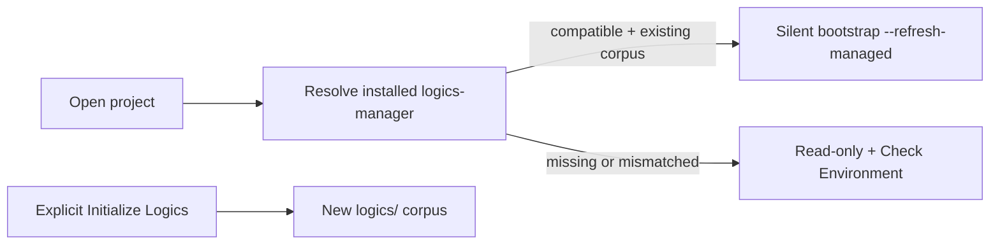

## prod_075_one_logics_runtime_no_setup_noise - One Logics runtime, no setup noise
> Date: 2026-08-11
> Status: Settled
> Related request: `req_331_use_one_resolved_logics_manager_runtime_and_silently_refresh_existing_project_bootstrap`
> Related backlog: `item_690_resolve_and_enforce_one_compatible_installed_logics_manager_runtime`
> Related task: `task_328_deliver_the_single_runtime_and_silent_bootstrap_simplification`
> Related architecture: adr_027_use_the_installed_cli_as_the_only_vs_code_logics_runtime
> Reminder: Update status, linked refs, scope, decisions, success signals, and open questions when you edit this doc.
> Indicators reviewed: 2026-08-11 01:46:58

# Overview
Make the installed Logics Manager CLI the single runtime used by VS Code, quietly keep existing project bootstrap artifacts current, and reserve setup or global assistant changes for deliberate actions.

# Goals
- One predictable CLI version per project session.
- No startup popup cascade for healthy or recoverable projects.
- Silent, bounded maintenance of generated Logics bootstrap content.
- A clear separation between CLI installation, repository initialization, and optional assistant integration.

# Non-goals
- Installing npm, Python, or Logics Manager automatically from VS Code.
- Changing Logics document lifecycle semantics.
- Removing the standalone CLI, browser viewer, MCP server, or existing package distribution paths.
- Publishing skills globally as a side effect of normal project use.

# Scope and guardrails
- In: scaffolded request, product, backlog, orchestration task, validation, and handoff context.
- Out: unrelated workflow docs and implementation of generated tasks.

# Key product decisions
- VS Code uses only a PATH-resolved `logics-manager` CLI whose version exactly matches the extension version; mismatch is read-only, never a hidden fallback.
- Existing valid corpora refresh only generated files and marked managed regions through a silent CLI-managed bootstrap refresh.
- First-time corpus creation is explicit; Git initialization, commits, and global assistant changes are never silent.
- Plugin-owned global assistant publication is removed from normal use. Global skills are an explicit `logics-manager skills install` operation.

# Success signals
- Generated docs pass lint and audit without broad manual rewrites.
- Context-pack output can be handed to an implementation agent directly.

# References
- Product back-reference: `item_690_resolve_and_enforce_one_compatible_installed_logics_manager_runtime`
- Task back-reference: `task_328_deliver_the_single_runtime_and_silent_bootstrap_simplification`
