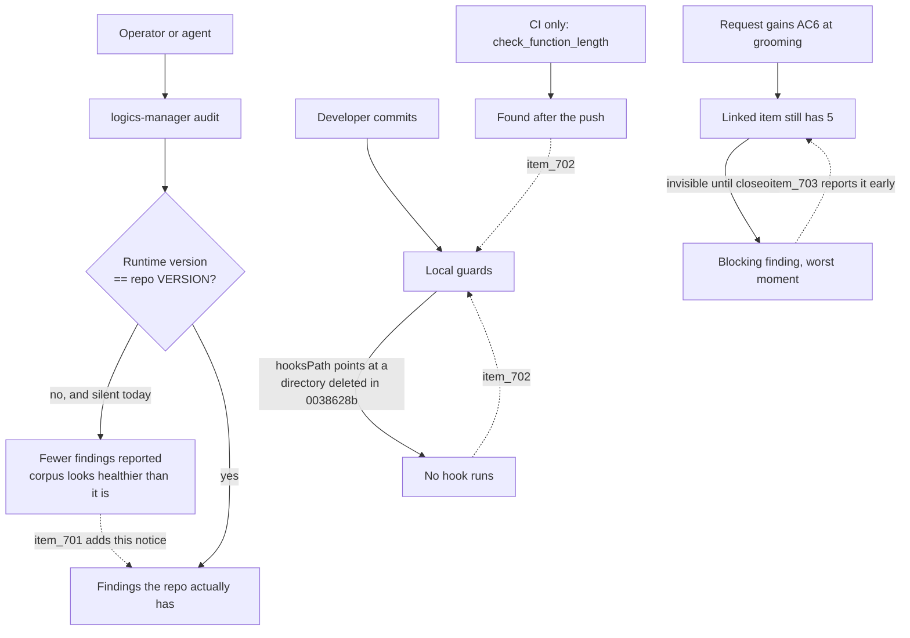

## prod_076_tooling_that_tells_the_truth_about_itself - Tooling that tells the truth about itself
> Date: 2026-08-11
> Status: Settled
> Related request: `req_340_close_the_three_trust_gaps_the_2_21_7_cycle_exposed`
> Related backlog: `item_701_report_a_runtime_that_disagrees_with_the_repository_it_audits`, `item_702_make_every_guard_reachable_before_the_push`, `item_703_report_a_request_criterion_no_linked_document_accounts_for`
> Related task: `task_337_deliver_the_three_trust_gaps_from_the_2_21_7_cycle`
> Related architecture: (none yet)
> Reminder: Update status, linked refs, scope, decisions, success signals, and open questions when you edit this doc.
> Indicators reviewed: 2026-08-11 11:00:10

# Overview
The corpus is only as trustworthy as the tool reporting on it. When the tool is silently a different version, or a guard exists only where the operator is not, the report becomes confident and wrong.

# Goals
- A report that cannot be produced by a runtime that disagrees with the repository without saying so.
- Every guard reachable where the work happens, not only after the push.
- Drift inside a chain surfaced while it is cheap to fix.

# Non-goals
- Gating on runtime version.
- Retrofitting existing workflow documents.
- Reinstating the retired mirror-sync tooling.

# Scope and guardrails
- In: scaffolded request, product, backlog, orchestration task, validation, and handoff context.
- Out: unrelated workflow docs and implementation of generated tasks.

# Key product decisions
- Use structured input as the source of truth for generated docs.
- Keep generated write paths local and repo-bounded.

# Success signals
- Generated docs pass lint and audit without broad manual rewrites.
- Context-pack output can be handed to an implementation agent directly.

# References
- Product back-reference: `req_340_close_the_three_trust_gaps_the_2_21_7_cycle_exposed`
- Task back-reference: `task_337_deliver_the_three_trust_gaps_from_the_2_21_7_cycle`
