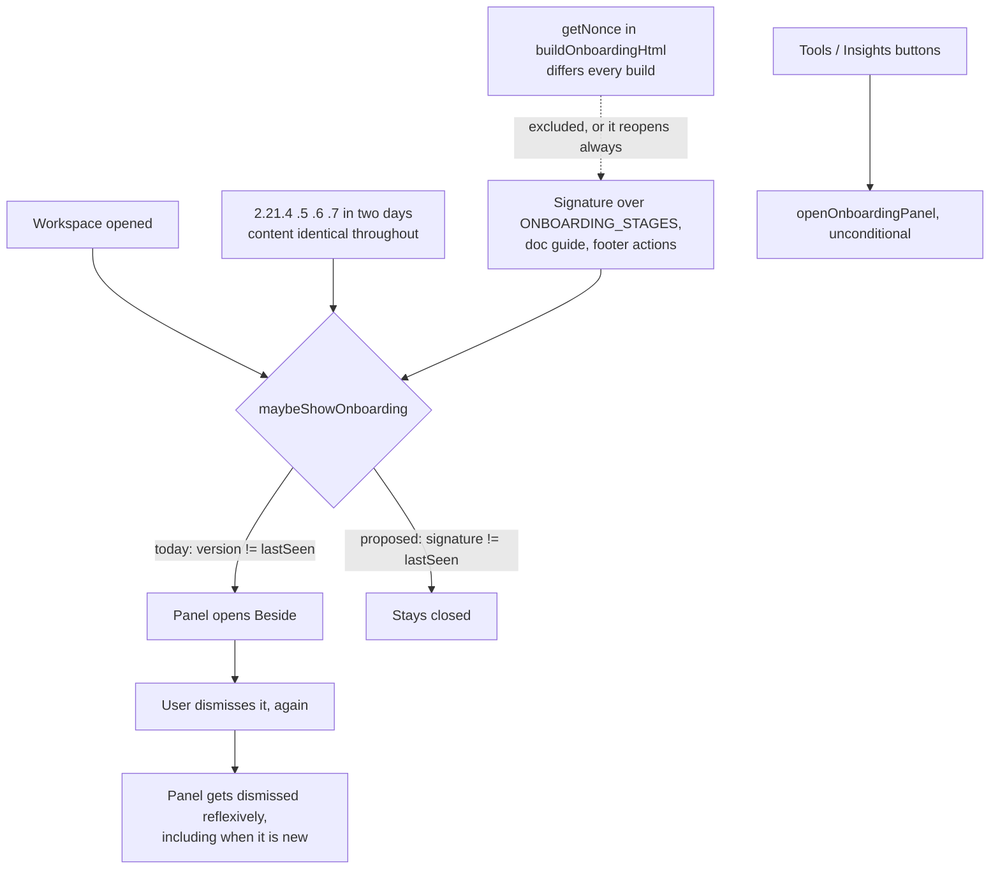

## prod_077_a_plugin_that_interrupts_only_when_it_has_something_new_to_say - A plugin that interrupts only when it has something new to say
> Date: 2026-08-11
> Status: Settled
> Related request: `req_341_stop_reopening_getting_started_when_its_content_has_not_changed`
> Related backlog: `item_704_key_the_onboarding_guard_on_page_content_instead_of_extension_version`
> Related task: `task_338_deliver_the_content_keyed_onboarding_guard`
> Related architecture: (none yet)
> Reminder: Update status, linked refs, scope, decisions, success signals, and open questions when you edit this doc.
> Indicators reviewed: 2026-08-11 11:00:10

# Overview
Getting Started is worth reading once. Reopening it unchanged spends the user's attention on material they have already read, and teaches them to dismiss the panel reflexively -- including the time it does have something new.

# Goals
- An interruption that is earned by new content, not by a version number.
- A signature that cannot drift from the page it describes.

# Non-goals
- Changing what the Getting Started page says.
- Adding a setting to suppress it permanently.
- Touching the on-demand entry points.

# Scope and guardrails
- In: scaffolded request, product, backlog, orchestration task, validation, and handoff context.
- Out: unrelated workflow docs and implementation of generated tasks.

# Key product decisions
- Use structured input as the source of truth for generated docs.
- Keep generated write paths local and repo-bounded.

# Success signals
- Generated docs pass lint and audit without broad manual rewrites.
- Context-pack output can be handed to an implementation agent directly.

# References
- Product back-reference: `req_341_stop_reopening_getting_started_when_its_content_has_not_changed`
- Task back-reference: `task_338_deliver_the_content_keyed_onboarding_guard`
