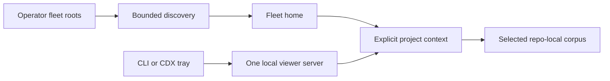

## prod_078_a_standalone_fleet_home_for_the_canonical_logics_viewer - A standalone fleet home for the canonical Logics viewer
> Date: 2026-08-12
> Status: Proposed
> Related request: `req_342_launch_a_standalone_logics_fleet_viewer_through_one_shared_local_server`
> Related backlog: `item_705_define_standalone_fleet_launch_and_bounded_operator_fleet_roots`, `item_706_make_project_context_request_scoped_before_sharing_the_viewer_server`, `item_707_build_the_fleet_home_and_project_navigation_surface`, `item_708_replace_per_repository_viewer_reuse_with_a_safe_fleet_singleton`
> Related task: `task_339_deliver_the_standalone_fleet_viewer_and_singleton_server`
> Related architecture: `adr_028_scope_the_fleet_viewer_registry_to_the_operator_profile_and_resolve_project_context_per_request`
> Reminder: Update status, linked refs, scope, decisions, success signals, and open questions when you edit this doc.

# Overview
Evolve the existing local viewer from a repository-launched server with a mutable shared project into a standalone fleet home. One local server serves the canonical viewer, discovers projects only beneath operator-chosen roots, and resolves every request against an explicit allowed project context. CDX can launch or reuse that viewer, while each project's Markdown corpus remains local and independent.

# Goals
- Open Logics first, then choose a project rather than requiring a project before launch.
- Give operators a bounded, useful fleet overview without a central project database or full-disk scan.
- Reuse one local viewer server across CLI and VS Code while preventing cross-tab project-context leakage.
- Preserve existing project workflows, viewer features, and local/LAN security boundaries.
- Provide a stable launch contract that CDX can invoke from its tray.

# Non-goals
- A separate Logics tray application, background daemon, notification system, or autostart mechanism.
- A centralized cloud service, remote project management, or synchronization of project data.
- Recursive scanning of arbitrary folders, scanning the entire home directory, or a hand-maintained registry of every project.
- A merged cross-project document board or cross-project writes; the fleet home is navigation and aggregate health, then one explicit project context at a time.
- Changing MCP HTTP-server reuse semantics.

# Scope and guardrails
- In: scaffolded request, product, backlog, orchestration task, validation, and handoff context.
- Out: unrelated workflow docs and implementation of generated tasks.

# Key product decisions
- Use structured input as the source of truth for generated docs.
- Keep generated write paths local and repo-bounded.

# Success signals
- Generated docs pass lint and audit without broad manual rewrites.
- Context-pack output can be handed to an implementation agent directly.

# References
- Product back-reference: `logics/request/req_342_launch_a_standalone_logics_fleet_viewer_through_one_shared_local_server.md`
- Task back-reference: `logics/tasks/task_339_deliver_the_standalone_fleet_viewer_and_singleton_server.md`
