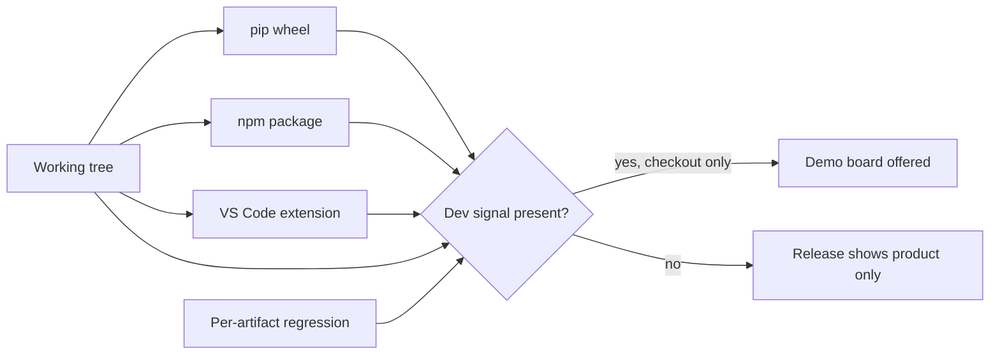

## prod_079_a_release_that_contains_only_the_product - A release that contains only the product
> Date: 2026-08-13
> Status: Proposed
> Related request: `req_343_keep_the_synthetic_demo_board_out_of_every_released_artifact`
> Related backlog: `item_709_gate_the_demo_board_on_a_signal_release_artifacts_cannot_carry`, `item_710_prove_the_demo_is_absent_from_each_built_artifact`
> Related task: `task_340_deliver_the_release_safe_demo_gate_and_its_per_artifact_proof`
> Related architecture: (none yet)
> Reminder: Update status, linked refs, scope, decisions, success signals, and open questions when you edit this doc.
> Indicators reviewed: 2026-08-13 13:03:35

# Overview
Development affordances earn their place in a checkout and lose it in a release. The demo board is the visible instance; the durable goal is that dev-only surfaces are gated on something a release artifact positively asserts, and that the gate is proven against the artifacts themselves rather than against the working tree.

# Goals
- No dev-only surface reaches a user through any distribution channel.
- A dev gate that a packaging change cannot silently invert.
- Coverage that tests the built artifact, not a stand-in for it.

# Non-goals
- Removing or reducing the demo corpus, which stays valuable in a dev checkout.
- Redesigning the fleet home.
- Changing what the three distribution channels ship, beyond what the gate requires.

# Scope and guardrails
- In: scaffolded request, product, backlog, orchestration task, validation, and handoff context.
- Out: unrelated workflow docs and implementation of generated tasks.

# Key product decisions
- Use structured input as the source of truth for generated docs.
- Keep generated write paths local and repo-bounded.

# Success signals
- Generated docs pass lint and audit without broad manual rewrites.
- Context-pack output can be handed to an implementation agent directly.

# References
- Product back-reference: `req_343_keep_the_synthetic_demo_board_out_of_every_released_artifact`
- Task back-reference: `task_340_deliver_the_release_safe_demo_gate_and_its_per_artifact_proof`
