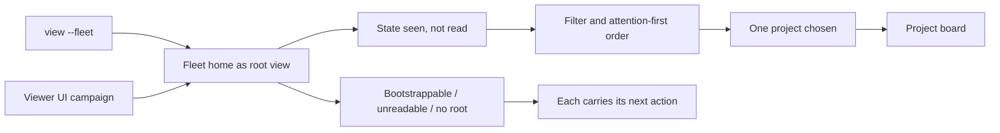

## prod_080_a_fleet_home_an_operator_can_triage_from - A fleet home an operator can triage from
> Date: 2026-08-13
> Status: Settled
> Related request: `req_344_make_the_fleet_home_read_as_the_product_s_first_screen`
> Related backlog: `item_711_present_the_fleet_home_as_the_root_view_in_fleet_mode`
> Related task: `task_341_deliver_the_fleet_home_first_screen_redesign`
> Related architecture: (none yet)
> Reminder: Update status, linked refs, scope, decisions, success signals, and open questions when you edit this doc.

# Overview
The fleet home answers one question -- where do I look next -- for an operator holding more projects than they can hold in their head. It should answer it by glance rather than by reading, and it should present as the place the product starts rather than as a panel over somewhere else.

# Goals
- A first screen that reads as a destination, not as an overlay.
- Triage by glance: state carried by form and colour, numbers read only once a project has been picked out.
- A screen that still works at twenty projects.

# Non-goals
- New fleet data or new endpoints; the payloads already carry what the screen needs.
- Changing the board, the document screens, or the project switcher menu.
- The demo project's visibility, tracked in `logics/request/req_343_keep_the_synthetic_demo_board_out_of_every_released_artifact.md`.

# Scope and guardrails
- In: scaffolded request, product, backlog, orchestration task, validation, and handoff context.
- Out: unrelated workflow docs and implementation of generated tasks.

# Key product decisions
- Use structured input as the source of truth for generated docs.
- Keep generated write paths local and repo-bounded.

# Success signals
- Generated docs pass lint and audit without broad manual rewrites.
- Context-pack output can be handed to an implementation agent directly.

# References
- Product back-reference: `item_711_present_the_fleet_home_as_the_root_view_in_fleet_mode`
- Task back-reference: `task_341_deliver_the_fleet_home_first_screen_redesign`
