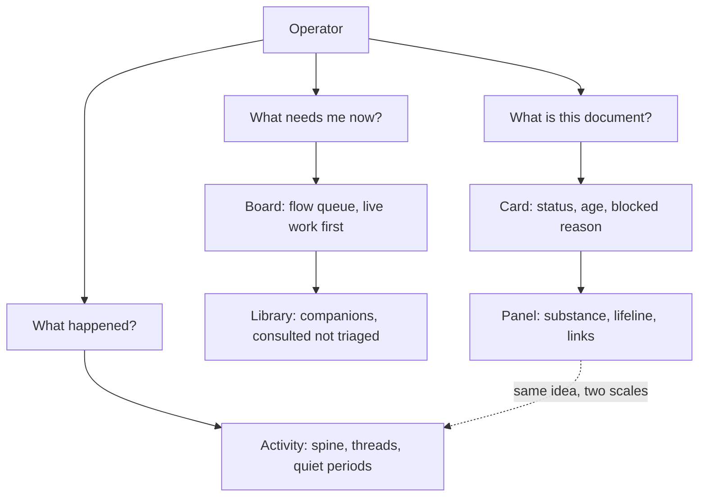

## prod_081_a_project_view_that_leads_with_what_is_live - A project view that leads with what is live
> Date: 2026-08-13
> Status: Proposed
> Related request: `req_345_make_the_project_view_lead_with_the_work_that_is_live`
> Related backlog: `item_716_confirm_what_the_payload_can_and_cannot_tell_about_chains_and_lifelines`, `item_717_split_the_board_into_a_flow_queue_and_a_companion_library`, `item_718_open_the_board_on_the_work_that_is_live`, `item_719_reallocate_the_card_face_to_the_facts_that_vary`, `item_720_make_selecting_a_card_one_mechanism`, `item_721_lead_the_details_panel_with_what_the_document_says`, `item_722_give_a_document_a_lifeline_in_the_details_panel`, `item_723_draw_the_activity_feed_as_a_chronology`, `item_724_tell_one_chain_s_story_in_the_activity_feed`, `item_725_cover_the_board_the_selected_state_the_panel_and_the_feed_in_the_campaign`
> Related task: `task_342_deliver_the_project_view_that_leads_with_live_work`
> Related architecture: (none yet)
> Reminder: Update status, linked refs, scope, decisions, success signals, and open questions when you edit this doc.

# Overview
The viewer's project surfaces should answer an operator's questions in the order they are asked: what needs me now, what is this document, and what happened. Today each surface answers a different question -- what documents exist, what this document is called, and what was written most recently -- and leaves the useful answer one or more clicks away.

# Goals
- Live work leads; finished work is available but does not set the scale of the screen.
- Every visual channel carries the fact that varies, not the fact already known from position.
- Opening a document tells you what it says and where it stands, without a further click.
- History reads as a history: ordered, threaded, and honest about quiet periods.

# Non-goals
- New workflow data the viewer does not already serve, except where a stated risk proves it necessary.
- The fleet home, the document reader and editor, and the Workshop, Remote and CDX screens.
- Changing what any document contains or how documents are authored.

# Scope and guardrails
- In: scaffolded request, product, backlog, orchestration task, validation, and handoff context.
- Out: unrelated workflow docs and implementation of generated tasks.

# Key product decisions
- Use structured input as the source of truth for generated docs.
- Keep generated write paths local and repo-bounded.

# Success signals
- Generated docs pass lint and audit without broad manual rewrites.
- Context-pack output can be handed to an implementation agent directly.

# References
- Product back-reference: `req_345_make_the_project_view_lead_with_the_work_that_is_live`
- Task back-reference: `task_342_deliver_the_project_view_that_leads_with_live_work`
