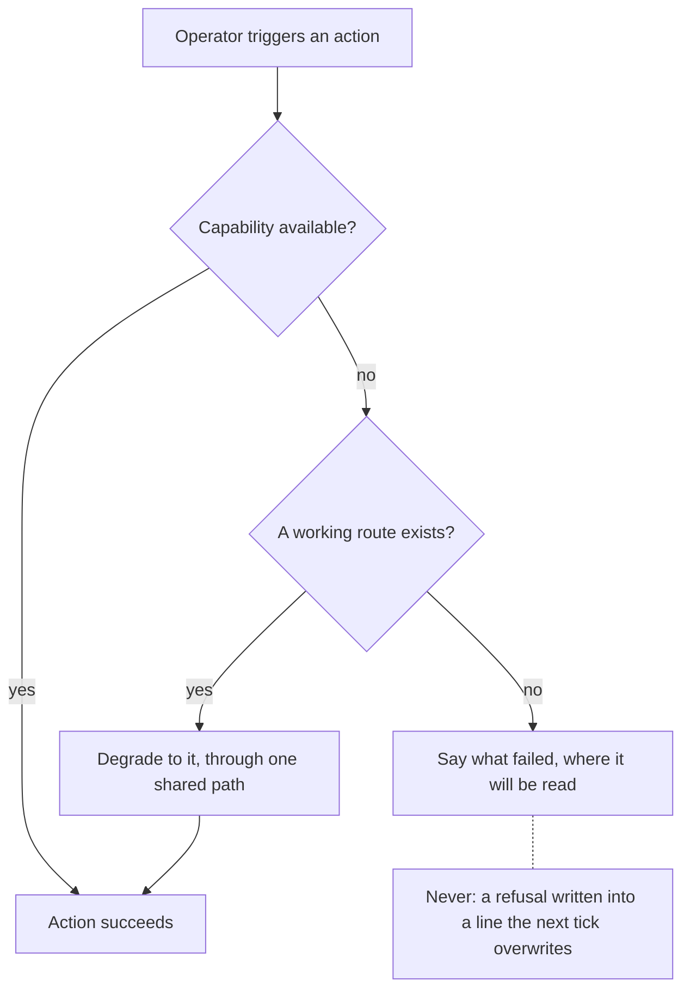

## prod_082_a_viewer_that_recovers_and_says_what_happened - A viewer that recovers, and says what happened
> Date: 2026-08-13
> Status: Settled
> Related request: `req_346_close_the_gaps_behind_a_fleet_root_click_that_does_nothing`
> Related backlog: `item_726_let_the_fleet_root_picker_recover_the_way_the_project_picker_already_does`
> Related task: `task_343_deliver_the_fleet_root_recovery_visible_failures_and_an_honest_fleet_flag`
> Related architecture: (none yet)
> Reminder: Update status, linked refs, scope, decisions, success signals, and open questions when you edit this doc.

# Overview
An operator should never have to guess whether a click did nothing or failed. When an action cannot run in the environment it finds, the viewer should route around it if a route exists, and say so plainly if none does. Flags should mean what they are documented to mean.

# Goals
- No viewer action fails silently.
- A capability that is unavailable in one environment degrades to one that works, through a single shared path.
- A flag decides the behaviour it names.

# Non-goals
- The fleet home's design, the board, the details panel and the activity feed.
- How fleet roots are discovered or scanned once added.
- Adding a native dialog dependency, or requiring a particular Python interpreter.

# Scope and guardrails
- In: scaffolded request, product, backlog, orchestration task, validation, and handoff context.
- Out: unrelated workflow docs and implementation of generated tasks.

# Key product decisions
- Use structured input as the source of truth for generated docs.
- Keep generated write paths local and repo-bounded.

# Success signals
- Generated docs pass lint and audit without broad manual rewrites.
- Context-pack output can be handed to an implementation agent directly.

# References
- Product back-reference: `item_726_let_the_fleet_root_picker_recover_the_way_the_project_picker_already_does`
- Task back-reference: `task_343_deliver_the_fleet_root_recovery_visible_failures_and_an_honest_fleet_flag`
