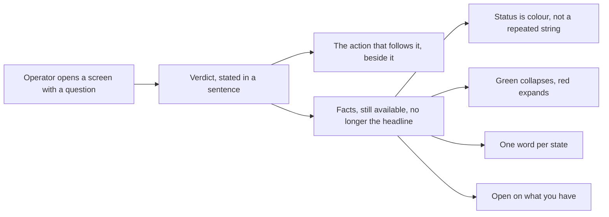

## prod_083_screens_that_state_their_answer - Screens that state their answer
> Date: 2026-08-13
> Status: Settled
> Related request: `req_347_make_the_git_ci_release_and_settings_screens_answer_their_own_question`
> Related backlog: `item_731_open_the_git_screen_on_content_and_lead_it_with_a_verdict`
> Related task: `task_344_deliver_the_git_ci_release_and_settings_redesign`
> Related architecture: (none yet)
> Reminder: Update status, linked refs, scope, decisions, success signals, and open questions when you edit this doc.

# Overview
An operational screen is opened with a question. Git is opened to learn whether the work is safe; CI to learn whether it passed; Release to learn whether it can ship; Settings to learn what this viewer is doing. A screen that shows the facts and withholds the conclusion makes the reader do the reasoning every single time, and makes them do it under time pressure.

# Goals
- Every operational screen states its verdict, and offers the action that follows it.
- Facts stay available and stop being the headline.
- Nothing is said twice; nothing that matters is said only in grey small text.
- What is broken takes the room; what is fine takes a line.

# Non-goals
- The fleet home, the board, the details panel and the activity feed.
- The Workshop and CDX screens.
- The behaviour of the MCP connector, the release gates, or the CI workflows themselves -- only how they are reported.

# Scope and guardrails
- In: scaffolded request, product, backlog, orchestration task, validation, and handoff context.
- Out: unrelated workflow docs and implementation of generated tasks.

# Key product decisions
- Use structured input as the source of truth for generated docs.
- Keep generated write paths local and repo-bounded.

# Success signals
- Generated docs pass lint and audit without broad manual rewrites.
- Context-pack output can be handed to an implementation agent directly.

# References
- Product back-reference: `item_731_open_the_git_screen_on_content_and_lead_it_with_a_verdict`
- Task back-reference: `task_344_deliver_the_git_ci_release_and_settings_redesign`
