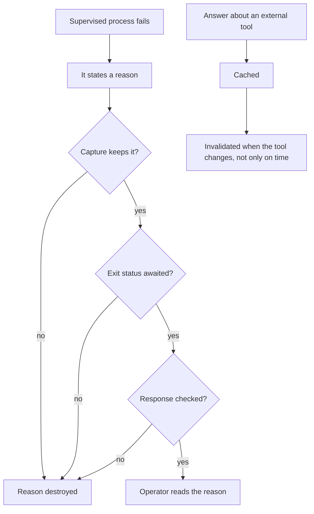

## prod_084_a_viewer_that_repeats_what_it_was_told - A viewer that repeats what it was told
> Date: 2026-08-13
> Status: Settled
> Related request: `req_348_stop_the_viewer_from_swallowing_a_diagnostic_and_from_repeating_a_stale_update`
> Related backlog: `item_741_pass_the_connector_s_own_failure_reason_through_to_the_operator`
> Related task: `task_345_deliver_the_connector_diagnostics_and_the_version_aware_update_check`
> Related architecture: (none yet)
> Reminder: Update status, linked refs, scope, decisions, success signals, and open questions when you edit this doc.

# Overview
The viewer supervises other programs and reports on them. When one of them explains itself, that explanation is the most valuable thing the viewer holds, and passing it through is worth more than any wording the viewer could invent. When the viewer caches an answer about the outside world, the cache should end when the answer does.

# Goals
- A supervised process's own words reach the operator.
- A failure is never reported as silence.
- A cached fact about an external tool dies when that fact changes.

# Non-goals
- What the MCP connector does once running, and how it chooses a port.
- The screen redesigns tracked in the other viewer requests.
- Managing which of several installed executables is the right one.

# Scope and guardrails
- In: scaffolded request, product, backlog, orchestration task, validation, and handoff context.
- Out: unrelated workflow docs and implementation of generated tasks.

# Key product decisions
- Use structured input as the source of truth for generated docs.
- Keep generated write paths local and repo-bounded.

# Success signals
- Generated docs pass lint and audit without broad manual rewrites.
- Context-pack output can be handed to an implementation agent directly.

# References
- Product back-reference: `item_741_pass_the_connector_s_own_failure_reason_through_to_the_operator`
- Task back-reference: `task_345_deliver_the_connector_diagnostics_and_the_version_aware_update_check`
