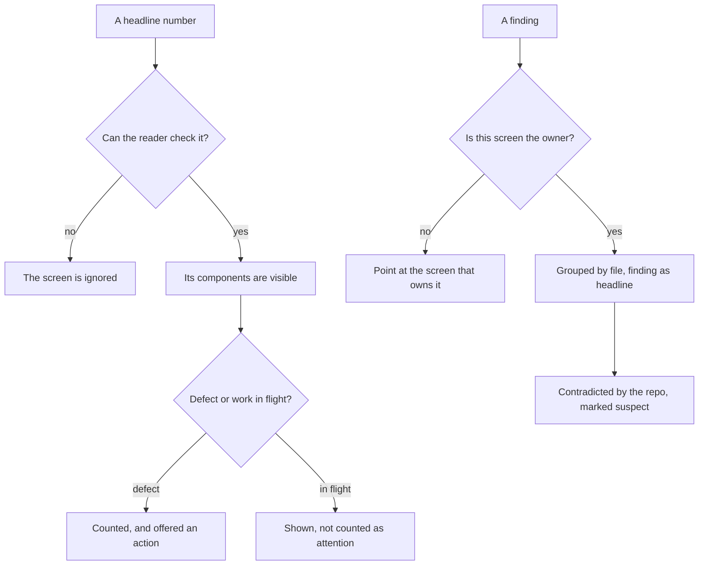

## prod_085_numbers_a_screen_can_defend - Numbers a screen can defend
> Date: 2026-08-13
> Status: Settled
> Related request: `req_349_make_the_corpus_health_and_onboarding_screens_earn_the_numbers_they_print`
> Related backlog: `item_746_decide_which_workflow_signals_are_defects_and_which_are_work_in_flight`
> Related task: `task_346_deliver_the_corpus_health_and_onboarding_screens`
> Related architecture: (none yet)
> Reminder: Update status, linked refs, scope, decisions, success signals, and open questions when you edit this doc.

# Overview
A dashboard is trusted or ignored, and it decides which within about two readings. A count that mixes defects with the normal state of new work, a total printed beside its own component, and a finding contradicted by the filesystem all teach the same lesson: do not rely on this screen. These surfaces already have the right instincts; what they need is for their numbers to survive being checked.

# Goals
- Every headline number means one thing, and the reader can see how it was arrived at.
- What is wrong is separated from what is merely unfinished.
- A screen states the answers it owns and points at the ones it does not.
- Guidance orients the project in front of it rather than an imaginary empty one.

# Non-goals
- The audit and lint rules themselves; this covers how their results are presented.
- Workshop and the CDX family.
- The board, fleet home, details panel, activity feed and Remote screens, covered by the other viewer requests.

# Scope and guardrails
- In: scaffolded request, product, backlog, orchestration task, validation, and handoff context.
- Out: unrelated workflow docs and implementation of generated tasks.

# Key product decisions
- Use structured input as the source of truth for generated docs.
- Keep generated write paths local and repo-bounded.

# Success signals
- Generated docs pass lint and audit without broad manual rewrites.
- Context-pack output can be handed to an implementation agent directly.

# References
- Product back-reference: `item_746_decide_which_workflow_signals_are_defects_and_which_are_work_in_flight`
- Task back-reference: `task_346_deliver_the_corpus_health_and_onboarding_screens`
