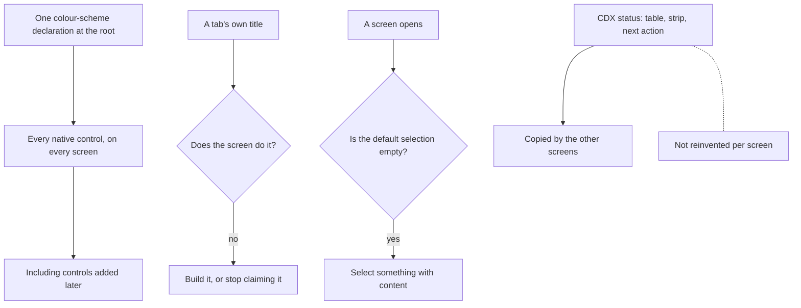

## prod_086_a_viewer_that_looks_like_one_product - A viewer that looks like one product
> Date: 2026-08-13
> Status: Proposed
> Related request: `req_350_theme_the_viewer_s_native_controls_and_finish_the_workshop_and_cdx_screens`
> Related backlog: `item_755_give_the_viewer_s_native_controls_the_interface_s_own_colour_scheme`, `item_756_make_the_command_list_readable_at_the_size_it_actually_is`, `item_757_make_the_runbooks_screen_do_what_its_tab_claims`, `item_758_open_the_explorer_on_something_worth_reading`, `item_759_bring_the_cdx_screens_onto_the_shape_status_already_proves`, `item_760_cover_the_reviewed_workshop_and_cdx_screens`
> Related task: `task_347_deliver_the_control_theming_and_the_workshop_and_cdx_screens`
> Related architecture: (none yet)
> Reminder: Update status, linked refs, scope, decisions, success signals, and open questions when you edit this doc.

# Overview
Forty controls rendering in the browser's default light theme, a tab that promises three capabilities and offers one, and two screens that open on their emptiest state all say the same thing to an operator: parts of this were finished and parts were not. Consistency is not decoration here; it is the difference between a tool that reads as maintained and one that reads as a prototype.

# Goals
- Every control belongs to the interface it sits in.
- A screen does what its own label says it does.
- A screen opens on something worth looking at.
- Where one screen has already solved a problem well, the others copy it instead of inventing.

# Non-goals
- The Workshop Terminals tab, excluded by instruction.
- The document reader and editor, the new-document modal, the filter panel, the minimized dock, the project tools and the LAN banner.
- Changing what any command, runbook or mission does.

# Scope and guardrails
- In: scaffolded request, product, backlog, orchestration task, validation, and handoff context.
- Out: unrelated workflow docs and implementation of generated tasks.

# Key product decisions
- Use structured input as the source of truth for generated docs.
- Keep generated write paths local and repo-bounded.

# Success signals
- Generated docs pass lint and audit without broad manual rewrites.
- Context-pack output can be handed to an implementation agent directly.

# References
- Product back-reference: `req_350_theme_the_viewer_s_native_controls_and_finish_the_workshop_and_cdx_screens`
- Task back-reference: `task_347_deliver_the_control_theming_and_the_workshop_and_cdx_screens`
