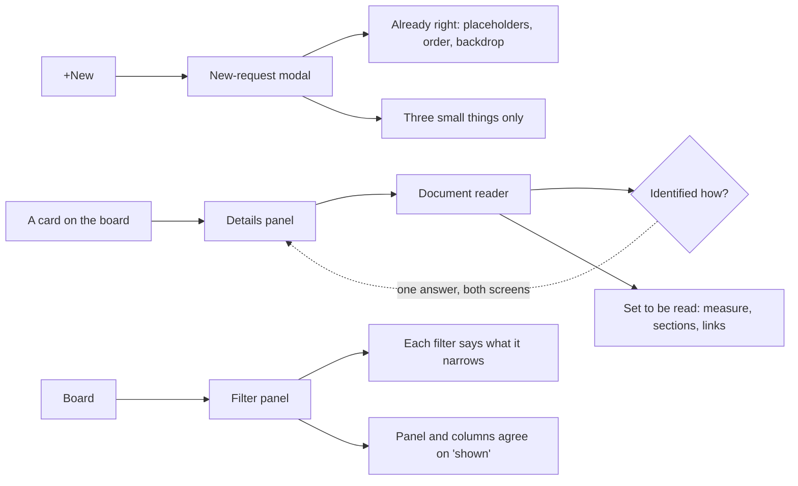

## prod_087_surfaces_that_read_like_they_were_finished - Surfaces that read like they were finished
> Date: 2026-08-13
> Status: Proposed
> Related request: `req_351_make_the_reader_readable_and_the_filter_panel_say_something`
> Related backlog: `item_761_stop_the_reader_leading_with_a_path_in_capitals`, `item_762_make_the_reader_a_place_to_read`, `item_763_finish_the_new_request_modal_without_redesigning_it`, `item_764_make_each_filter_say_what_it_would_narrow`, `item_765_make_the_panel_and_the_board_agree_on_what_is_shown`, `item_766_cover_the_reader_the_modal_and_the_filter_panel`
> Related task: `task_348_deliver_the_reader_the_modal_and_the_filter_panel`
> Related architecture: (none yet)
> Reminder: Update status, linked refs, scope, decisions, success signals, and open questions when you edit this doc.

# Overview
The last surfaces an operator meets are the ones nobody revisits: the reader they land in from a card, the modal that creates their work, the panel that narrows their board. Each is a few decisions away from being right, and one of them already is. The goal is to finish them without redesigning what already works.

# Goals
- A screen made of prose is set to be read.
- A document is identified the same way wherever it appears.
- A control says what it would do, and steps back when it can do nothing.
- What is already right is left alone and said to be right.

# Non-goals
- The Workshop Terminals tab, excluded by instruction.
- The document editor, the minimized dock, the project tools and the LAN banner, none of which could be driven in this pass.
- The details panel itself, redesigned separately.

# Scope and guardrails
- In: scaffolded request, product, backlog, orchestration task, validation, and handoff context.
- Out: unrelated workflow docs and implementation of generated tasks.

# Key product decisions
- Use structured input as the source of truth for generated docs.
- Keep generated write paths local and repo-bounded.

# Success signals
- Generated docs pass lint and audit without broad manual rewrites.
- Context-pack output can be handed to an implementation agent directly.

# References
- Product back-reference: `req_351_make_the_reader_readable_and_the_filter_panel_say_something`
- Task back-reference: `task_348_deliver_the_reader_the_modal_and_the_filter_panel`
